Greek for Universe was Cosmos and Cosmos was Chaos  
Chaos gave birth to the Primordial Deities (First Order)  

The deities where the things they presented  
They could also turn into a form that could walk and talk

### The First Order

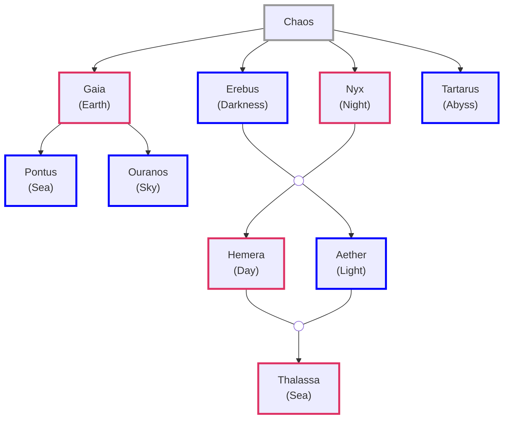

**Ouranos** (**Uranus**): Sky, Heavens  
**Thalassa** female counterpart of **Pontus**  
**Tartarus**: Greatest depths of earth

### The Second Order

Gaia loved the Cyclopes & Hecatonchires  
Ouranos was revolted by them and cursed them to never see the light  
They where pushed back into Gaia's womb

Gaia went to Mount Othyrs which looks over central Greek region of Phthiotis  
From its rocks she crafted a weapon (Sickle)

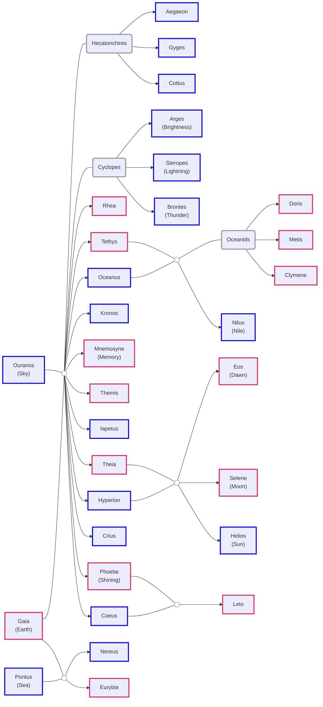

**Cyclopes**: One-eyed Giants  
**Hecatonchires**: Fifty Heads and Hundred Hands  
**Oceanids**: Sea Nymphs

**Cottus**: The Furious  
**Gyges**: The Long-Limbed  
**Aegaeon**: The Sea-goat (**Briareos**: The Vigorous One)

**Metis**: Clever and Wise  
**Themis**: Law, Justice & Custom
**Leto** (**Latona**): Demure

| Father   | Mother  | Children                                                   |
| :------- | :------ | :--------------------------------------------------------- |
| Oceanus  | Tethys  | Nile, other rivers & 3000 Oceanids - Clymene, Metis, Doris |
| Coeus    | Phoebe  | Leto                                                       |
| Crius    | Eurybia |                                                            |
| Hyperion | Theia   | Helios, Selene, Eos                                        |
| Iapetus  | Cylmene | Atlas, Epimetheus, Prometheus                              |

#### Nyx Decendents

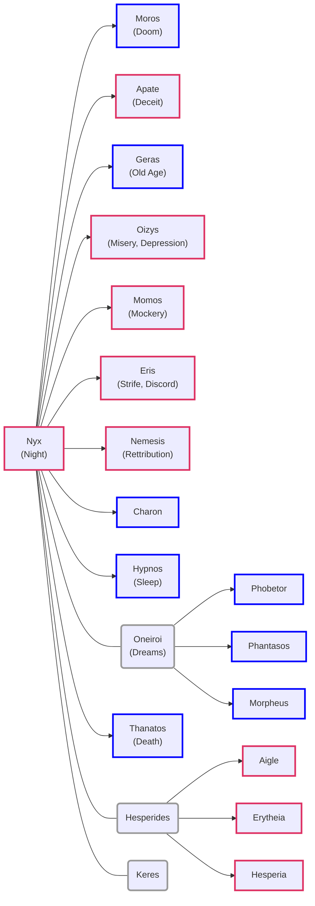

**Apate**: (**Farus**) - Fraud, Fraudulent, Fraudster  
**Geras**: (**Senectus**) - Senior, Senate, Senile  

**Oizys** (**Miseria** in Latin): Misery, Depression  
**Thanatos** (**Mors**): Death  

**Phobetor**: God of Nigtmares  
**Phantasos**: Things changing shapes in dream  
**Morpheus**: Shapeshifter  

**Hesperia**: Nymphs of the west and daughters of the evening (Magic Hour)

**Keres**: Death Goddess. Drawn to violet deaths on battlefield. Feasted on bodies

[Nyx - Wikipedia](https://en.wikipedia.org/wiki/Nyx)  
[What gods are considered to be kids of Nyx? - Quora](https://www.quora.com/What-gods-are-considered-to-be-kids-of-Nyx-Or-were-any-creatures-created-by-her-or-associated-with-her)

Kronos cuts his Fathers genitals and throws it over the mountain  
His Father curses him "May your children do as you destroy me"  
Ourano's blood fell on the ground and give rise to Eriynes, Gigantes and Meliae  
It lands in the sea near the Ionian island of Cythera which turned into Aphrodite

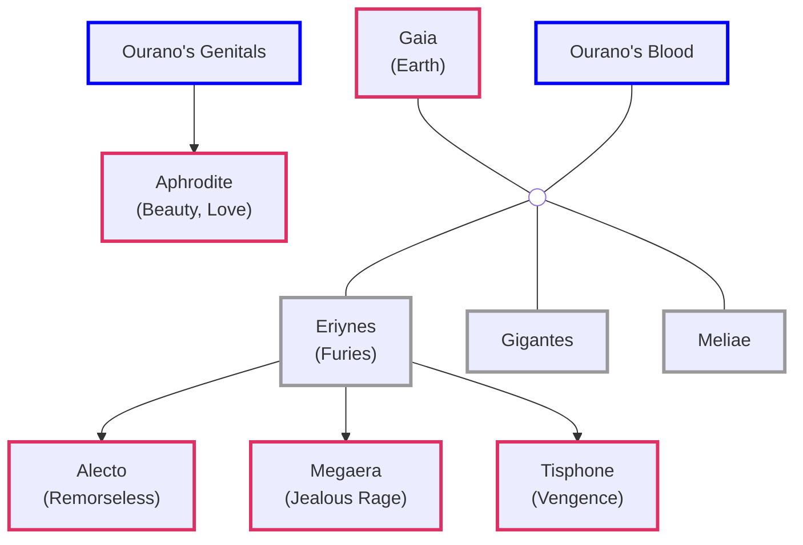

**Eriynes**: Eumenides (Kindly Ones)  
**Meliae**: Nymphs of the Ash Tree  
**Aphrodite** (**Venus**): Beauty, Love

#### Other Decedents

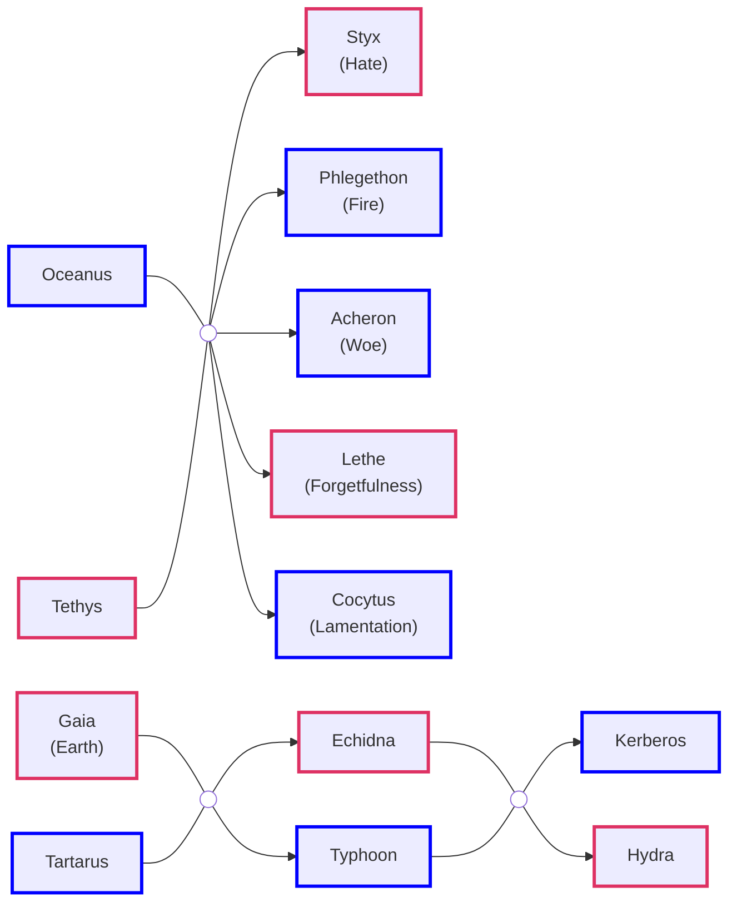

**Kerberos** (**Cerberus**): Three-headed dog with snake tail  

#### The Horai (Hours)

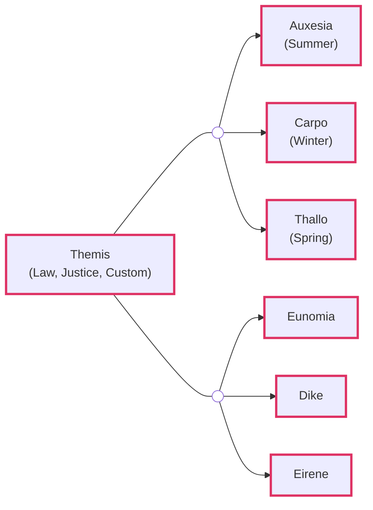

**Thallo**: Spring (Roman: **Flora**)

**Eunomia**: Law and Legislation  
**Dike**: Justice and Moral Order (Roman: **Justitia**)  
**Eirene**: Peace (Roman: **Pax**)

#### The Moirai (Fates)

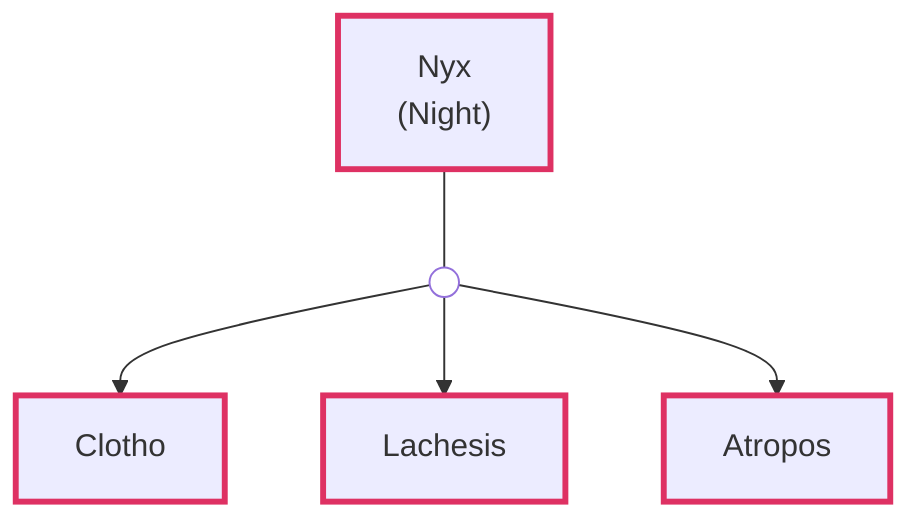

**Clotho**: Spins Thread of Life  
**Lachesis**: Measures Thread of Life  
**Atropos**: Cuts Thread of Life

#### The Gorgons

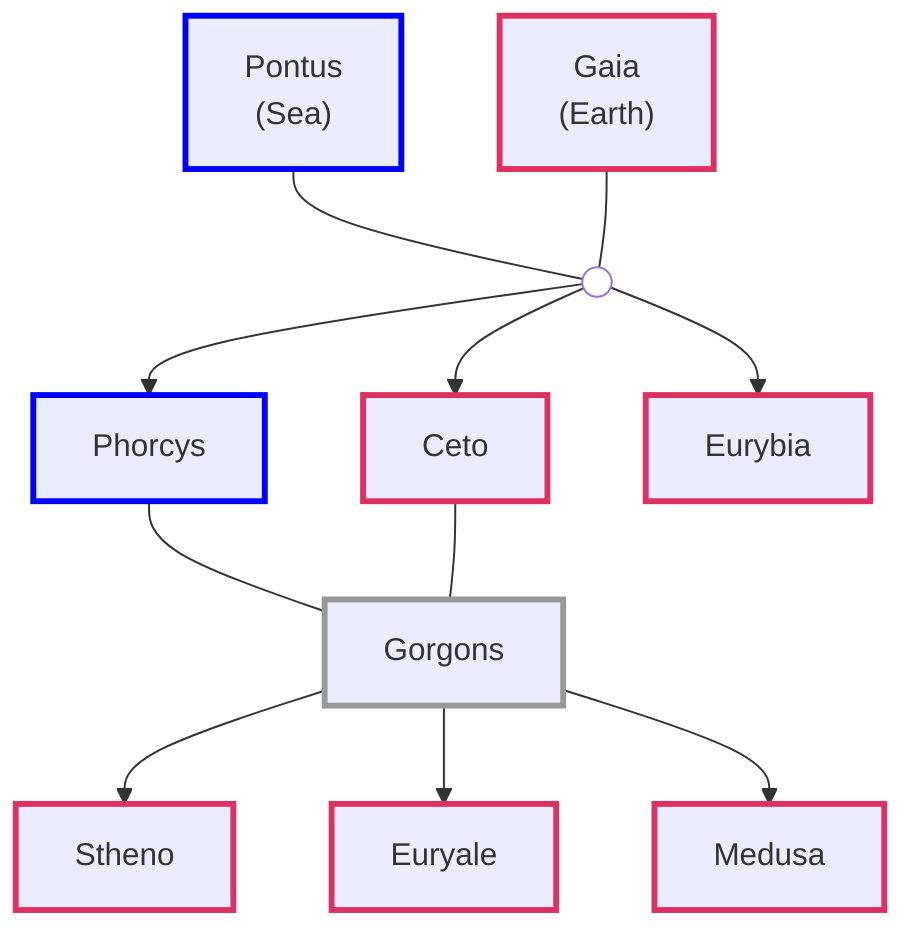

### The Olympians

Kronos became the Lord of the Earth, Sea and Sky  
He freed the Cyclopes & Hecatonchires from Gaia's omb and locked them in Tartarus  

He swallowed the 1st five children that where born to him by Rhea  
Before Zeus was born Rhea tricked Kronos into eating a large stone  
Rhea went to Crete where Zeus was born and was taken care of by Meliae and a she-goat  
Rhea put Metis in charge of teaching Zeus guile, craft and patience  

Metis created a tonic which Zeus gives to Koros  
This causes Kronos to vomit out the children and stone he had eaten  
The children where vomited in the reverse order they where born  
In this way Zeus became the elders Olympian when though he was born last

Zeus threw the stone far away and it landed in Pytho  
Zeus tried to kill Kronos but could not use the Sickle as Gaia was protecting her son  

There was a fierce war between the Olympians the Titans - Titanomachy  
Zeus freed Cyclopes & Hecatonchires from Tarturas and promised them freedom if they helped him and his siblings

Zeus wins the war over the Titans and becomes God of Gods (Heavens)  
Exiles his father to travel the world, measuring out eternity in lonely exile
Atlas (Zeus strongest enemy) is punished to hold the sky in place for eternity  
Hecatonchires are made guards of the roads that lead to the entrance to Tartarus  
Zeus assigns different domains to this siblings

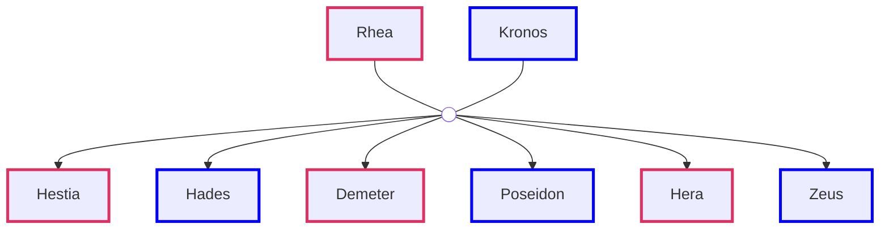

**Hestia** (**Vesta**): Hearth  
**Hades** (**Pluto**): Underworld  
**Poseidon** (**Neptune**): Ocean & Seas  
**Demeter** (**Ceres**): Harvest, Fertility and Seasons  
**Hera** (**Juno**): Marriage & Childbirth  
**Zeus** (**Jupiter**): Sky & Thunder

### Poseidon Lineage

**Nereus** son of **Gaia** & **Pontus**
**Doris** daughter of **Oceanus** & **Tethys** 

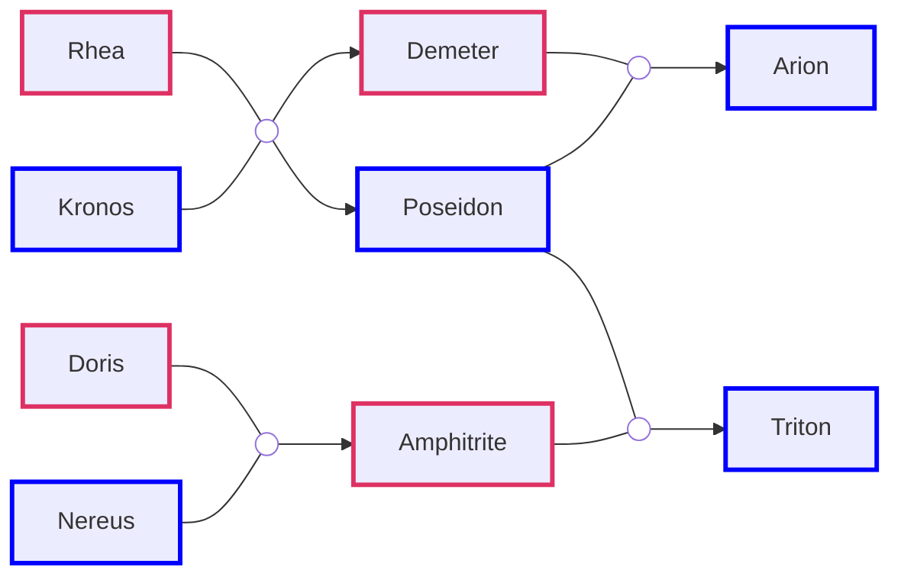

**Arion**: Horse with the power of speech  

### Zeus Lineage

Zeus through Mnemosyne and Eurynome has miltiple children  
None of them are considered Olympians

#### The Nine Muses

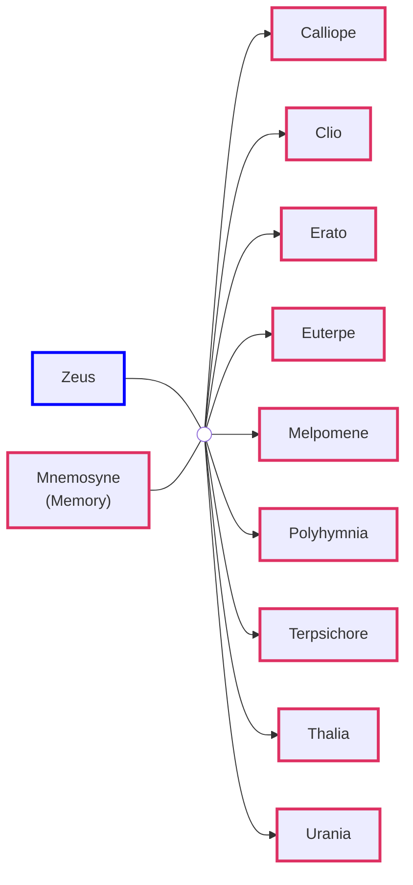

| Name | Position |
| :--- | :--- |
| Calliope (Beautiful Voice) | Muse of Epic Poetry |
| Clio | Muse of History |
| Erato | Muse of Lyric & Love Poetry |
| Euterpe (Delight, Joyous) | Muse of Music |
| Melpomene | Muse of Tragedy |
| Polyhymnia | Muse of Hymns |
| Terpsichore | Muse of Dance |
| Thalia | Muse of Idyllic Poetry |
| Urania | Muse of Astronomy |

#### The Charities (Three Graces)

**Eurynome** (Oceanid) daughter of **Oceanus** & **Tethys**

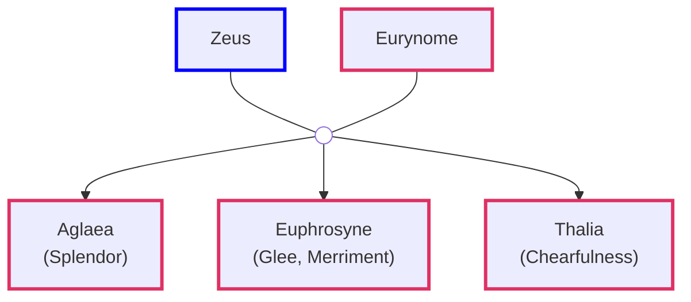

#### Olympian Children

Zeus has an affair with his sister Demeter and has a daughter Persephone  
Hera wants Zeus to be loyal to only her so she proposed the idea of public marriage  

When Hephaestus was born Hera throws him from Heaven  
On his mothers wedding he traps her in a chair no one is able to free her from the chair  
Hephaestus is able to free her from the chair and is given Aphrodite as wife  
Melissa (bee) makes Honey at the weeding feast and it becomes the food of the Gods   

Zeus has an affair with Metis in which he ends up swallowing her  
Zeus later has a unbearable headache which no one could find a cure
Hephaestus makes an axe and cuts Zeus head from which Athena is born  
Athena was born fully cloth in armor  
Metis remained trapped in Zeus and acts like a consigliere to guide him

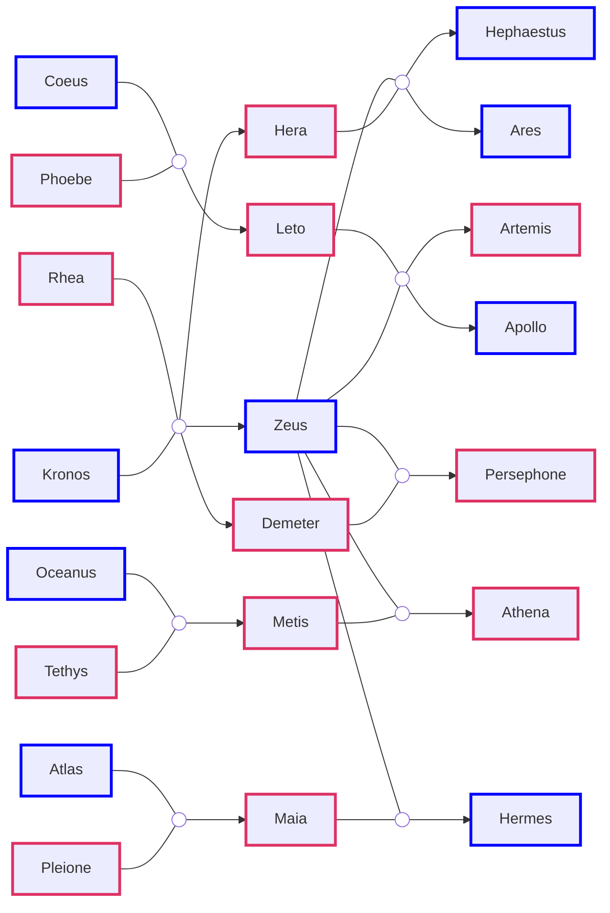

**Ares** (**Mars**): God of War  
**Hephaestus** (**Vulcan**): God of Fire & of Blacksmiths

**Athena** (**Minerva**): Wisdom, Warfare and Handicrafts  
**Artemis** (**Diana**): Wild animals, Hunt, Chastity and Childbirth  
**Apollo**: Sun, Archery, Healing, Prophecy, Knowledge and Music

Zeus has an affair with Leto. Hera hears about it and gets angry  
She asks Gaia to to put a curse on Leto and not provide her any place to give birth  
Leto eventually makes it to Delos a small island which is not bound to the Earth  

**Omphalos** stone that Rhea used to prevent Kronos from eating Zeus  
It landed on **Mount Parnassus** at a place called **Pytho**  
Considered the center of the world by the Greeks  
On command of Gaia a guardian of the stone emerged - Python  

Leto Gives birth to Artemis and Apollo. Hera tries to kill them again using Python  
Apollo asks Hephaestus to make bow and arrow for him using which he kills Python  
Python comes back to life as its protected by Gaia (Apollo is still a infant)  
Apollo exiled to Mount Parnassus and replaced Python as the guardian of **Omphalos**  

Pytho was later named to Delphi by Apollo  
Apollo was tasked by conducting athletic tournaments - Pythian Games  
Apollo also established an Oracle who anyone could ask about the future  
Zeus binds Delos to the Earth and made it the resting place for the Python

**11 Olympians**  
Zeus, Hera, Hestia, Poseidon, Demeter, Aphrodite  
Hephaestus, Ares, Athena, Artemis, Apollo

Zeus has a secret affair with Maia and has Hermes who becomes the 12 Olympian  
He was born in a cave in Mount Cyllene  
Hermes when he was not even 1/2 hour old made fire by rubbing two stones

**Hermes** (**Mercury**): Messenger of Gods, God of the Travelers, Thieves, Merchants  
