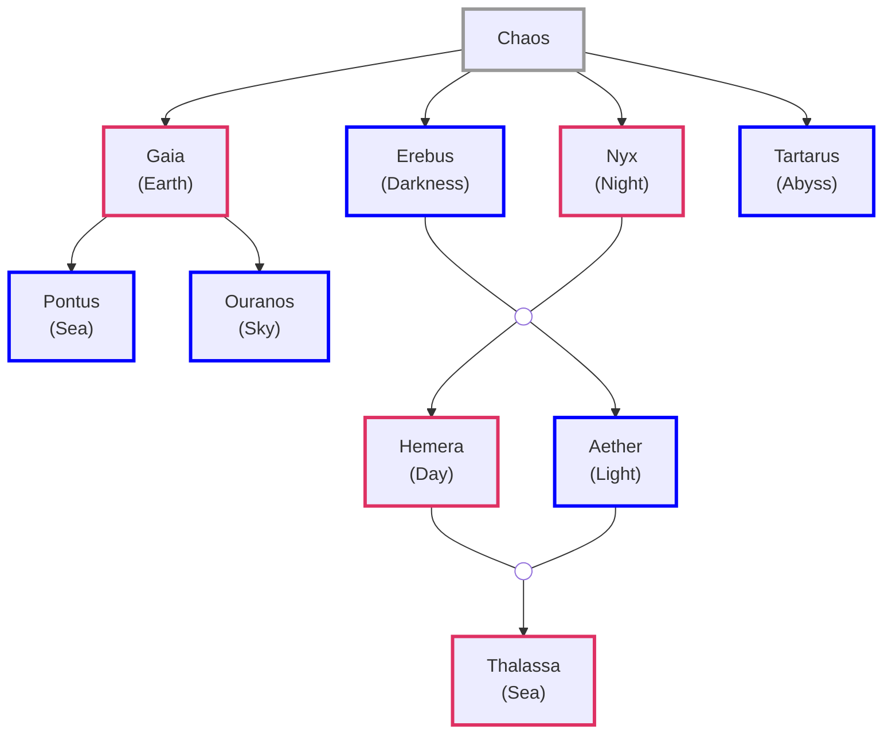
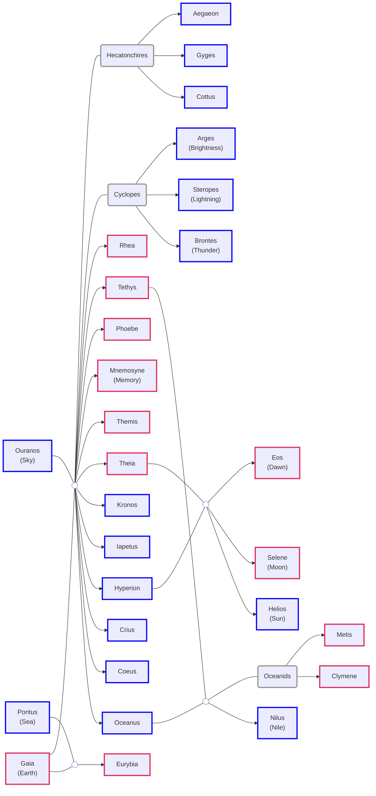
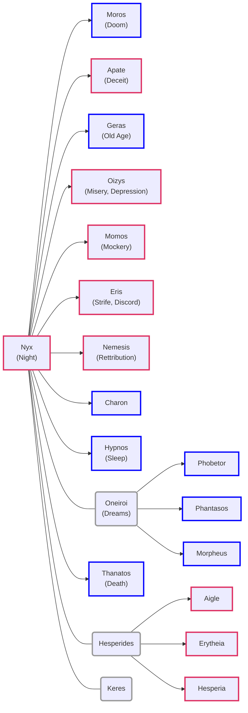
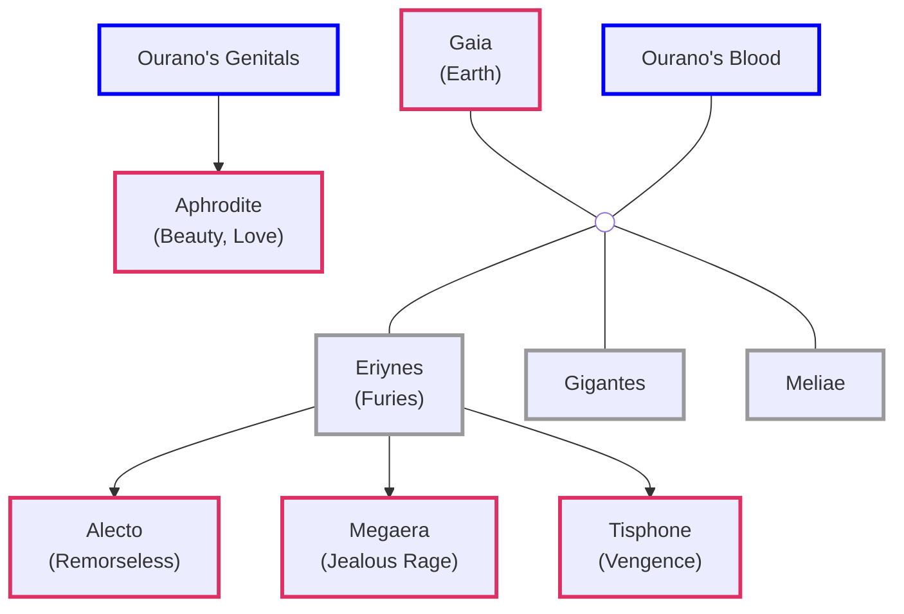
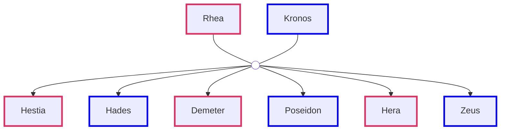
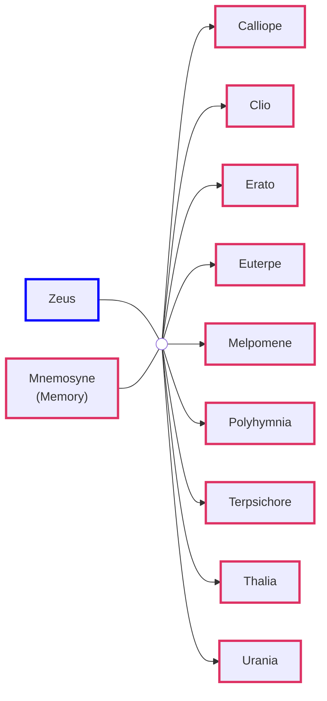
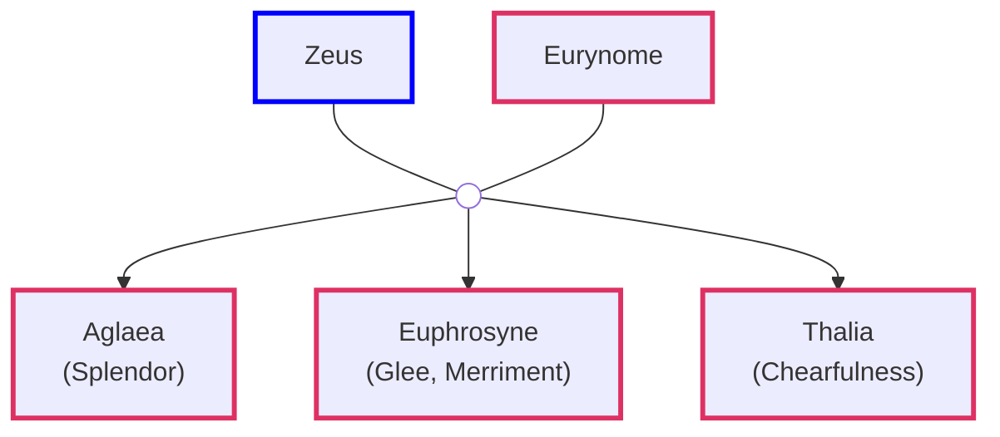
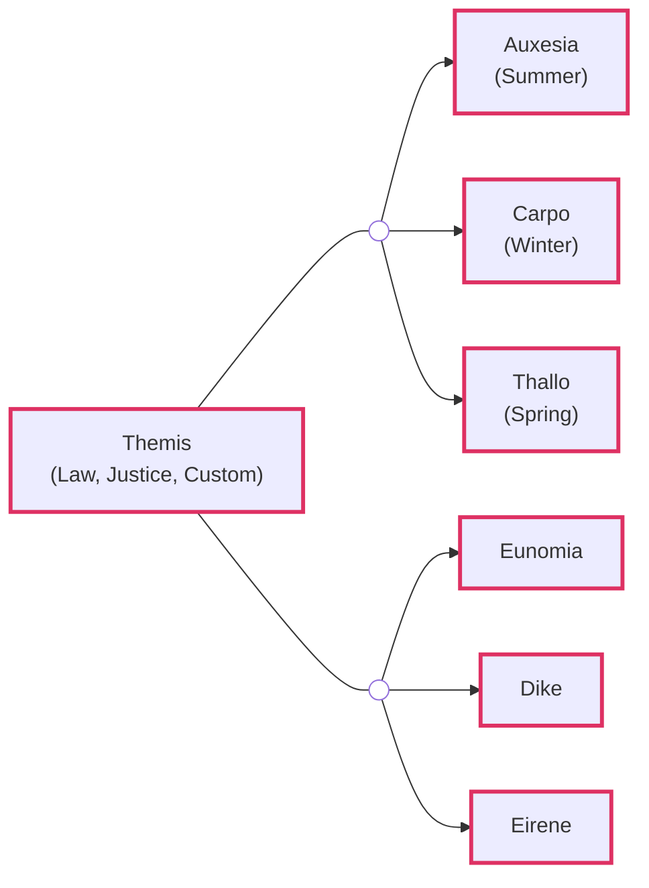
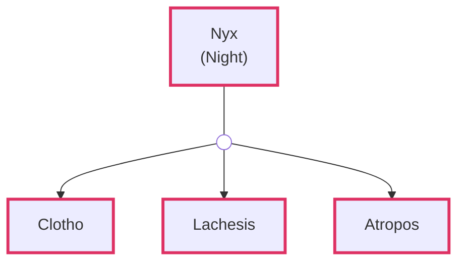
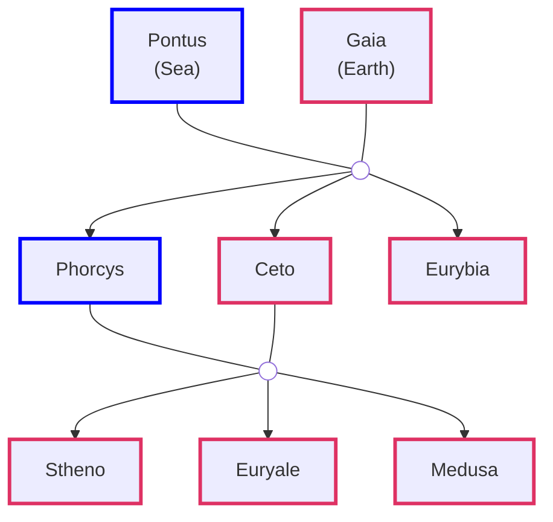

### The First Order

**Ouranos**: Uranus  
**Thalassa** female counterpart of **Pontus**  
**Tartarus**: Greatest depths of earth

### The Second Order

**Cyclopes**: One-eyed Giants  
**Hecatonchires**: Fifty Heads and Hundred Hands  
**Oceanids**: Sea Nymphs

**Cottus**: The Furious  
**Gyges**: The Long-Limbed  
**Aegaeon**: The Sea-goat (**Briareos**: The Vigorous One)

**Metis**: Clever and Wise  
**Themis**: Law, Justice & Custom

| Father | Mother | Children |
| :--- | :--- | :--- |
| Oceanus | Tethys | Nile, other rivers & 3000 Oceanids - Clymene, Metis |
| Coeus | Phoebe |  |
| Crius | Eurybia |  |
| Hyperion | Theia | Helios, Selene, Eos |
| Iapetus | Cylmene | Atlas, Epimetheus, Prometheus |

#### Nyx Decendents

**Apate**: (Farus in Roman) - Fraud, Fraudulent, Fraudster  
**Geras**: (Senectus in Roman) - Senior, Senate, Senile  

**Oizys**: (Miseria in Latin)  
**Thanatos**: (Mors in Roman)  

**Phobetor**: God of Nigtmares  
**Phantasos**: Things changing shapes in dream  
**Morpheus**: Shapeshifter  

**Hesperia**: Nymphs of the west and daughters of the evening (Magic Hour)

**Keres**: Death Goddess. Drawn to violet deaths on battlefield. Feasted on bodies

[Nyx - Wikipedia](https://en.wikipedia.org/wiki/Nyx)  
[What gods are considered to be kids of Nyx? - Quora](https://www.quora.com/What-gods-are-considered-to-be-kids-of-Nyx-Or-were-any-creatures-created-by-her-or-associated-with-her)

**Eriynes**: Eumenides (Kindly Ones)  
**Meliae**: Nymphs of the Ash Tree  
**Aphrodite**: (Venus in Roman)

### The Olympians

#### The Nine Muses

| Name | Position |
| :--- | :--- |
| Calliope (Beautiful Voice) | Muse of Epic Poetry |
| Clio | Muse of History |
| Erato | Muse of Lyric & Love Poetry |
| Euterpe (Delight, Joyous) | Muse of Music |
| Melpomene | Muse of Tragedy |
| Polyhymnia | Muse of Hymns |
| Terpsichore | Muse of Dance |
| Thalia | Muse of Idyllic Poetry |
| Urania | Muse of Astronomy |

#### The Charities (Three Graces)

**Eurynome** (Oceanid) daughter of **Oceanus** & **Tethys**

#### The Horai (Hours)

**Thallo**: Spring (Roman: **Flora**)

**Eunomia**: Law and Legislation  
**Dike**: Justice and Moral Order (Roman: **Justitia**)  
**Eirene**: Peace (Roman: **Pax**)

#### The Moirai (Fates)

**Clotho**: Spins Thread of Life  
**Lachesis**: Measures Thread of Life  
**Atropos**: Cuts Thread of Life

#### The Gorgons

