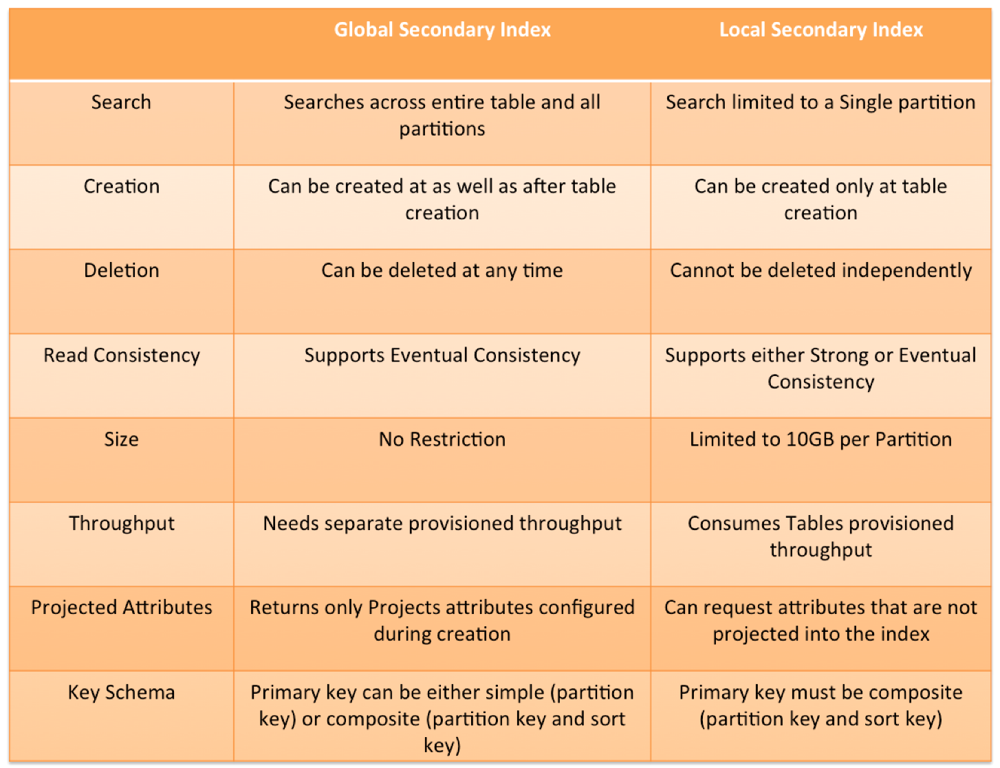

An alternate index that is create on the table that can alternatively be used to query the table
* Global: Index with partition and sort key can be different from those on the table
* Local: Index has the same partition key as table but different sort key (Made at Table creation)

