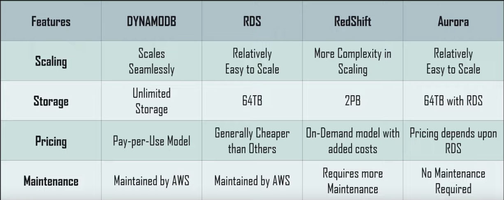

Provides high availability with replication across 3 Availability Zones  
We can store 100 TB of data and provides great performance  
Supports both document and key value storage of data  
DynamoDB is made of tables and we can infinite items (rows) in a table  
Max size of item 400 KB  
It is an eventual consistent DB (Supports AP)

### Core Components

Table: Collection of Data  
Items: An group of attributes (Rows). Table can have 0 or more items  
Attributes: Fundamental data element. Each item is made up of attributes

Data stored is schema less (Datatype and attributes of the items are not fixed)  
The attributes can be scalar (One or more value or nested in nature)  
Max supported nesting 32 levels

---

### Table of Content

* [Dynamo DB Primary Key](Dynamo%20DB%20Primary%20Key.md)
* [Dynamo DB Secondary Index](Dynamo%20DB%20Secondary%20Index.md)