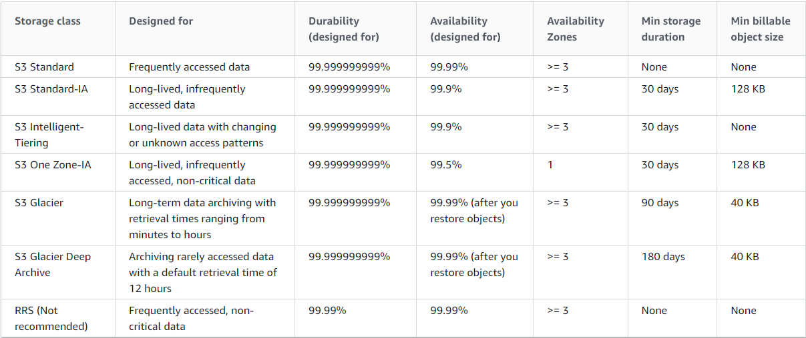

### Standard

Low latency  
Stored for short duration (Data that is used frequently)

### Standard - Infrequent Access

Long-lived, infrequently accessed data

### Standard - Reduced Redundancy

Store noncritical, reproducible data at lower levels of redundancy

### Intelligent

Long-lived data with changing or unknown access patterns

### Glacier

Long-term data archiving with retrieval times ranging from minutes to hours

### Glacier Deep Access

Archiving rarely accessed data with a default retrieval time of 12 hours

