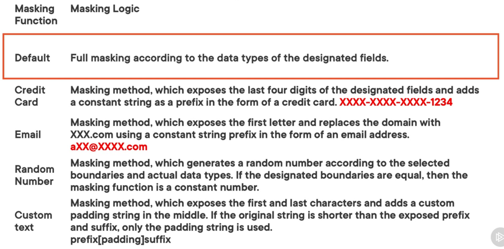

Also known as Data Obfuscation  
It is the process of hiding important/ classified information  
Data Masking is applicable for SQL Database, SQL Managed Instance and Azure Synapse Analytics

Making rules defines the set of columns that need to be masked along with the function that needs to be used for masking the data  
In the data masking blade in Azure Portal, suggestions are made on columns that could benefit from data masking

Data Masking cannot be applied to SQL Managed Instance using the Azure Portal  
It can be enabled directly from the portal or using T-SQL statements

Users with administrative privileges are always excluded from data masking

### Data Masking Functions

[Dynamic data masking - Azure SQL Database | Microsoft Docs](https://docs.microsoft.com/en-us/azure/azure-sql/database/dynamic-data-masking-overview)