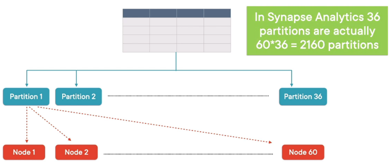
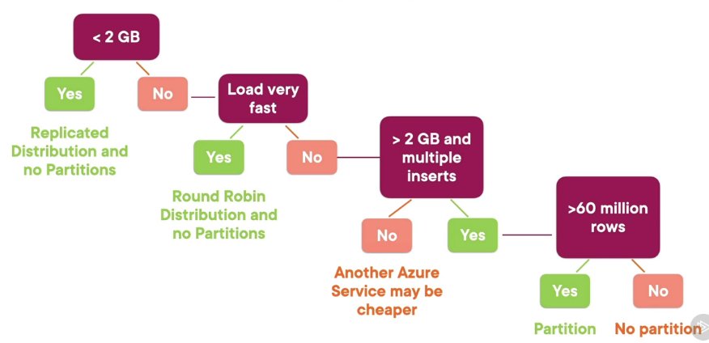

For optimal performance and compressing across clustered columnstore index (CCI) we need to ensure that each partition/ distribution should have at minimum 1 million records  
If each partition will have less than 60 million rows then it is recommended to reduce the number of partitions

[Partitioning tables in dedicated SQL pool - Azure Synapse Analytics | Microsoft Docs](https://docs.microsoft.com/en-us/azure/synapse-analytics/sql-data-warehouse/sql-data-warehouse-tables-partition)

---

### Hash Distribution

Distributes the rows across the compute nodes using a deterministic hash function  
Distributes the data evenly so that Synapse compute power can be properly utilized  
Works well for tables bigger than 2 GB  
Tables that have frequent insert, update and delete operations  
Generally used for Fact Tables in Star Schema

### Round Robin

It is the **default distribution** type in Synapse  
Assigns rows evenly across the nodes. The data is distributed in the nodes randomly  
There is no guarantee that similar data is going to be stored on the same node  
Joining a round robin table will always result in reshuffling resulting in a performance hit

Round Robin can be used if the table has no joining key or joins are performed very infrequently  
It there is no column that can distribute the data evenly using hash distribution  
Temporary tables are generally created using Round Robin distribution

### Replicated Table

It is a table that gets distributed across all 60 nodes of Synapse  
Useful for small tables and tables that are joined frequency against a big fact table  
Dimension tables are generally created using replicated distribution

---

### Hash Key Characteristics

The column should be used for grouping operations. The grouped records should lie in 1 distribution  
The hash key is used as join condition especially for large tables. This will prevent unnecessary data movement  
Has more than 60 distinct keys so that the data can be distributed across the 60 nodes in Synapse (Many unique values)  
It should not be a date column and should have very few (ideally no) NULL values

---

### Best Practices

For more than 60 million records Clustered Columnstore Index (CCI) provides the best performance  
For smaller tables heap and Clustered Index will provide better performance  
Heaps are useful for temporary storage and are a great choice for staging tables

For Hash distribution the column that is extensively used in join should be used  
If round robin is used on a dimension table then the column used in grouping operation should be used as key  
Round Robin tables provide good speed for data load operation

Frequently run queries are cache by Synapse at the Control Node  
We should not enable cache when working with large datasets as it will throttle the control nodes and degrade the overall performance

---

[Cheat sheet for dedicated SQL pool (formerly SQL DW) - Azure Synapse Analytics | Microsoft Learn](https://learn.microsoft.com/en-us/azure/synapse-analytics/sql-data-warehouse/cheat-sheet)