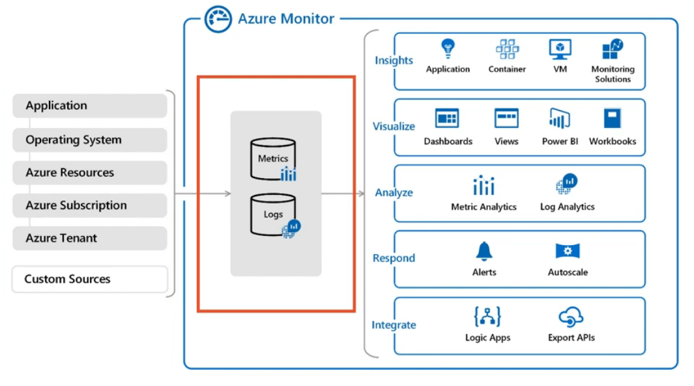

It is a powerful reporting and analytics tool  
It uses Log Analytics and the Metric Store as the backbone for providing resource insights

For some services like SQL server we need to manually enable auditing and monitoring before Azure Monitor can collect data  
For VM we need to install Log Analytics Agent for collecting its data

[Azure Alerts](../Azure%20Metrics%20&%20Logs/Azure%20Alerts.md) can be configured to be sent when certain conditions are satisfied

Activity Log: Gives insights into Subscription level events  

Azure Monitor Insights can be used to view KPIs for resources  
It can show Health, Performance, Capacity related insights