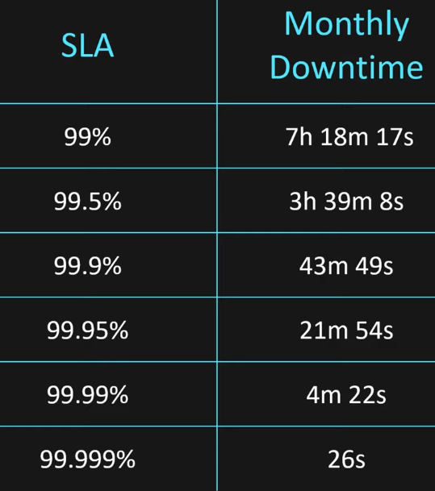
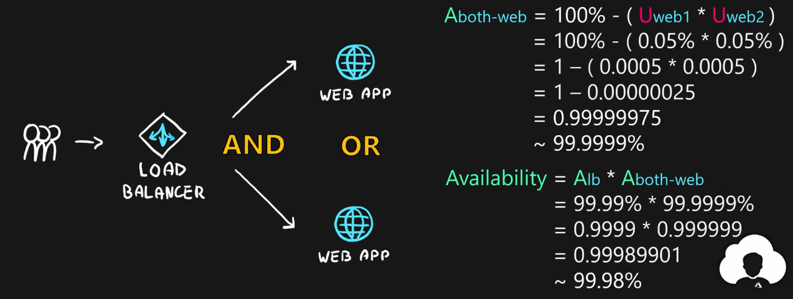

Formal agreement between service provider and customer  
SLA is the promise of the availability of an service (uptime and connectivity)  
SLA is a per month Availability agreement

Each service has a different SLA  
Free services generally do not have an SLA  
If SLA is broken user gets credit token (Discount)

Monthly Uptime Percentage = (Max Available Min - Downtime) / Max Available Min * 100

---

### Composite SLA

Combined SLA of services that are used in our application

<u>Logical AND</u>
  
Both services are required for functioning of application  
SLA = Sa * Sb

<u>Logical OR</u>
  
Both services are not required for the functioning of application  
SLA = 100% - (Sa * Sb)

#### Factors that lower SLA

Adding more services  
Using free/ preview services

#### Factors that increase SLA

Adding redundancy  
Changing service configuration