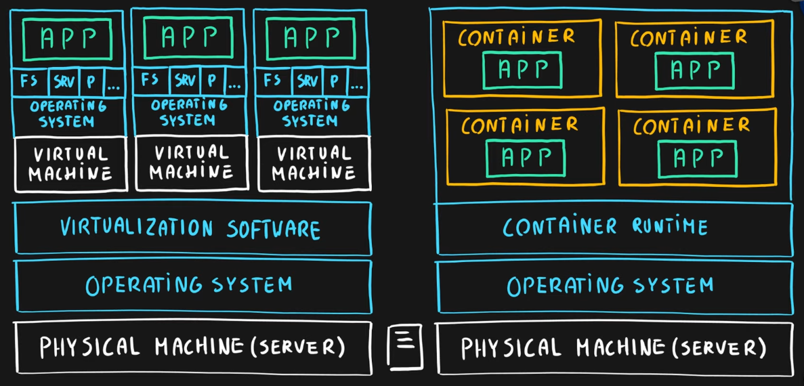

### Table of Content

- [Azure Virtual Machine](Azure%20Virtual%20Machine.md)
- [Azure Container Instance (ACI)](Azure%20Container%20Instance%20(ACI).md)
- [Azure Kubernetes Service (AKS)](Azure%20Kubernetes%20Service%20(AKS).md)
	- [Kubernetes](../../../Software%20Engineering/DevOps/Kubernetes/Kubernetes.md)
	- [Health Checks](Health%20Checks.md)
- **Azure App Service**
	- [Azure Service Plan](Azure%20Service%20Plan.md)
	- [Azure Web App](Azure%20Web%20App.md)
	- [Azure Function App](Azure%20Function%20App.md)

---

### Virtualization

Emulation of physical hardware  
Allows to have different virtual hardware configuration based on machine/app  
Allows to install different OS per machine/app  
Since each virtual machine is independent of each other it has its own FS, ports, services, storage, etc.

### Azure Service Fabric

Microsoft's native container orchestrator similar to [Kubernetes](../../../Software%20Engineering/DevOps/Kubernetes/Kubernetes.md)  
It is a distributed systems platform that allows us to run stateful applications

### Azure Batch

Allows to run large scale parallel and High Performance Computing (HPC) workloads on nodes (Virtual Machines) in a cluster

---

[Azure](../Azure.md)