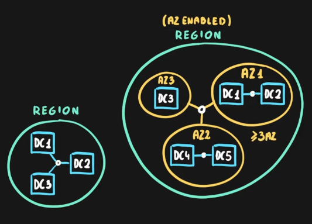

### Data Centers

A physical facility  
Hosting for a group of networked servers  
Has own power, cooling and networking infrastructure

---

### Regions

One or more data centers connected to each other through high throughput networks ( \< 2 milliseconds)  
Location where our services resides (Some services are not available in all regions)  
Some services are global services these services do not have any region assigned  
Azure has 50+ regions

Special regions are present for government use also (US DoD Central, US Gov Virginia)  
Partner Regions (China East, China North) : Regions not managed by Microsoft

---

### Availability Zones

Logical grouping of data centers that belong in a same region  
Designed to protect from data center failures  
If one zone goes down the others still continue to work

Two service categories:

* Zonal Services (VMs, Disks) : Allows to choose AZ
* Zone Redundant Services (SQL, Storage) : Service auto replicated at multiple AZs

Not all region supports AZ. Supported regions have 3 or more zones  
An AZ can comprise of multiple data centers as well

---

### Region Pair

Each pair is more than 300 miles apart  
These exist so that services don't go down if region level disaster occurs  
Region pairs are static. Each pair lies in the some geography  
Some services have Platform provided replication

---

### Geography

A geography is a discrete market that houses two or more Azure Regions  
Ensures that Data residency, sovereignty, resiliency and compliance requirements of that market are meet  
e.g. America, Europe, Asia Pacific, Middle East and Africa

---

### Azure Sovereign Regions

Azure for regions that have to meet very strict compliance and regulation needs

1. **<u>Azure Government</u>**  
   Azure for the US Government  
   It is an separate instance of Azure (There is an separate portal)  
   They are physically Isolated  
   Only Authorized Personals can access them

2. **<u>Azure China</u>**  
   Separate Instance  
   Physically Separated  
   Operated by 21Vianet (Companies that have a majority interest in foreign markets cannot setup business in China)