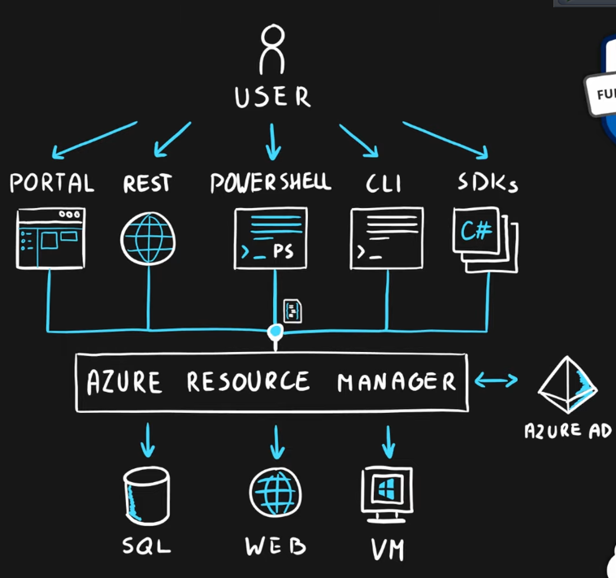

### Subscription

Billing unit for the entire Azure account

### Resource Manager

Management layer for resources and resource groups  
Unified Language  
Controls access and resources

### Resources

Objects that are used to represent services in Azure. Resources can be anything SQL, VM, Web, etc.  
Represents the service lifecycle of the object  
Any configuration that can be done on a resource is represented as a property on that resource  
Each Resource in Azure can be represented using JSON file in which the properties are denoted as key value pair

### Resource Groups

A logical container for holding resources in Azure. A resource cannot be created without a resource group

Resources can be organized into resource groups based on:

* Type of the resource
* Lifecycle (Testing, Development, etc.)
* Department
* Billing, Location

Each Resource can be in one Resource Group only  
An Resource Group has an region as well. It is used to store the metadata about the Resources  
Resources in a Resource Group can be at multiple locations. Resources can be moved between Resource Groups  
Resource Groups cannot be nested

---

[Azure](../Azure.md)