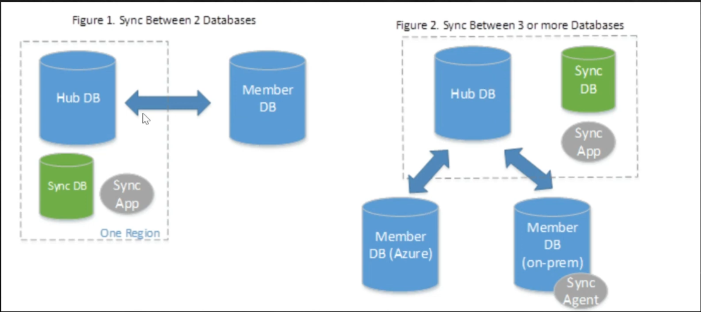

It is a service that is used to sync two or more databases  
The Hub DB has to always be on the cloud  
Member DB can be on-premises or in cloud

SQL Data Sync provides "Eventual Consistency"

**<u>Use cases</u>**  
- Disaster Recovery: Geo-redundant backups  
- Read Operation Scaling: Use read-only replicas  
- ETL: Data Factory  
- One Time Migration: Azure Database Migration Service
