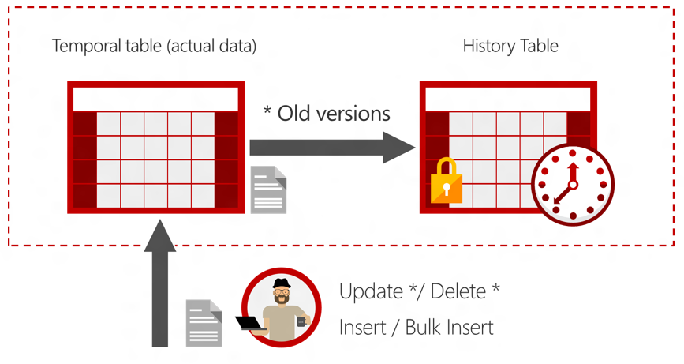

* Temporal Table or System versioned Temporal Table is a pair of two tables (current table and history table) that is used to track the current valid value and values that where valid in the past (historic values)
* They are created using the normal create table statement along with the `SYSTEM_VERSIONING = ON` clause
* We can specify an table that needs to be used as history table else an table will be automatically created by the system
* Both of these tables have two extra columns called Start Time and End Time which is used to track the time period in which the records where valid
* These fields are of `datetime2` datatype
* The history table cannot have any constraints (PK, FK, Table and Column level constraints) but the temporal table must have a PK

---

**<u>References</u>**:
* [Temporal Tables - SQL Server | Microsoft Docs](https://docs.microsoft.com/en-us/sql/relational-databases/tables/temporal-tables?view=sql-server-ver15)
