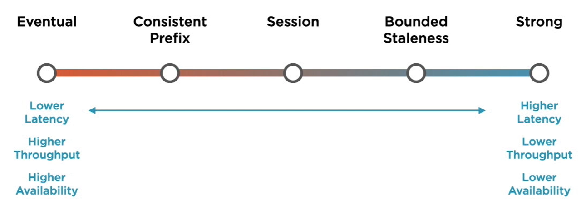

Consistency is set at the Account Level but it can be overwritten at request time

Gremlin & Table: Account Level Consistency  
Cassandra & MongoDB: Writes (Account Level), Reads (Request Level)

Strong Consistency: On read get the most recent data  
Bounded Staleness: Guarantees that the read data will have a max lag  
Session: Client Session will read its own writes  
Consistent Prefix: Guarantees updates are read in order  
Eventual: Provides no guarantee for order

Strong and Bounded Staleness both will consume twice the amount of RU's for a request

---

[Azure Datastore Services](../Azure%20Datastore%20Services.md)