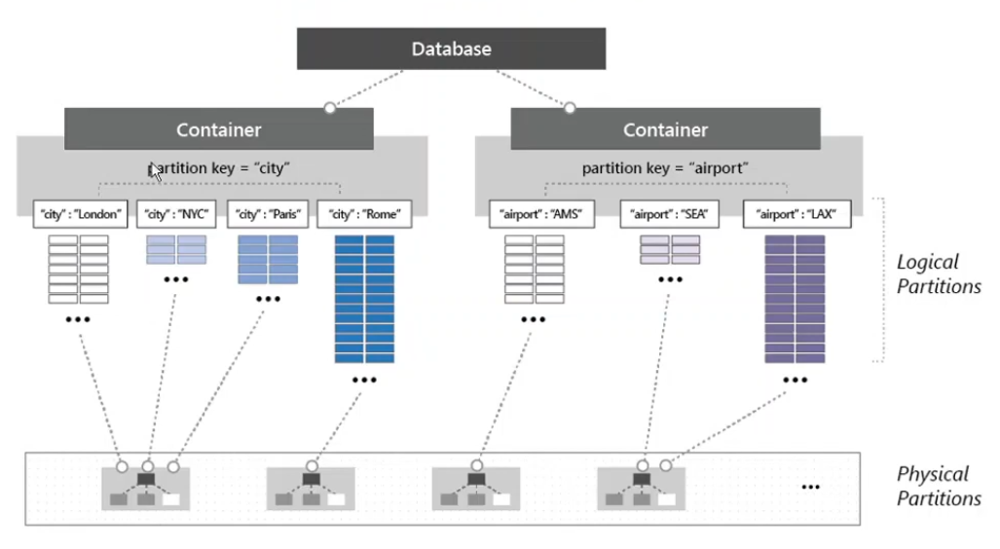

The database at the application level is partitioned into Containers  
A query can only access a single container at a time

Inside each container Cosmos DB partitions data based on partition key  
The partition key should be chosen carefully for even partitioning of data  
Additionally each row in a collection has a unique key that is used to identify individual records

The data is split logically based on the value of the partition key column  
We can have as many logical partitions are required but each partition is limited to 20 GB  
The logical partitions are then physically partitioned by storing them on different disks  
More than one logical partition can be saved onto the save disk  

The logical partitions are physically distributed by using an Hashing Algorithm  
Each physical partition has an replica set which allows to distribute the data globally  
Any transaction that occurs inside a logical partition of an container is ACID compliant

---

### Partitioning Best Practices

Cosmos DB throughput is distributed equally across all physical partitions  
When creating partitions we should try to avoid creating hot partitions as much as possible  
**Hot Partitions on Storage**: Large amount of data in single physical partition  
**Hot Partitions on Throughput**: Few partitions are queried very frequently

Key that will be used for partitioning should have a high cardinality (Many unique values)  
Partition column datatype should be String  
If column with numeric data is to be used it should be converted to a String  
The data in the column that is used as partition key should not be updated  
If such a column does not exist then we should use composite columns  

Physical limitations to consider:  
Max Item size: 2 MB  
Max logical partition size: 20 GB

---

[Azure Datastore Services](../Azure%20Datastore%20Services.md)