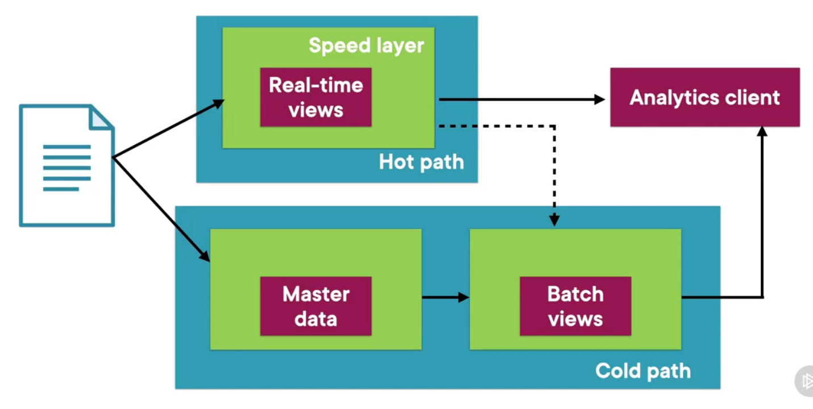

Batch processing is an umbrella term that is used to encompass the various big data processing approaches based on [MapReduce](../../../Data%20Analytics/Apache%20Hadoop/MapReduce.md)  
Batch Processing is a framework that processes as much data as possible at a regular cadence in the most efficient manner possible

---

### Lambda Architecture

When using ETL that uses MapReduce to process large amounts of data the reports that are generated are several hours old  
Because of this it is difficult to get real time information for some of the parameters even with same loss of accuracy

### Cold Path (Historical data)

Store all the data in its raw form and processes them in a batch. The result of this processing is called a batch view  
The batch layer stores the data in a serving layer where the data can be queried efficiently

### Hot Path/ Speed Layer (Real-time data)

This path processes the data in real time. It is designed for low latency fast processing at the cost of accuracy  
This data is stored as real-time views. The speed layer updates the serving layer by incrementally updating the data  
It must support random writes of data

 > [!NOTE]
 > * A drawback of Lambda Architecture is there is duplication of the processing logic. This increases the maintenance required for more complex applications
 > * Apache Spark is commonly used and recommended processing engine in the Lambda Architecture

**<u>Cruise Example</u>**  
Cold Path: Load the data into Azure when in land (docked)  
Hot Path: Get information about the local "delta" transactions that have taken place

---

### Kappa Architecture

In Kappa there is only one processing block which is the speed layer that processes data using real-time analysis  
The long term storage data/ batch processing is also done using the speed layer

Kappa is an ideal approach when real-time processing is the priority  
Kappa requires the all the data stream and metric to be incremental in nature