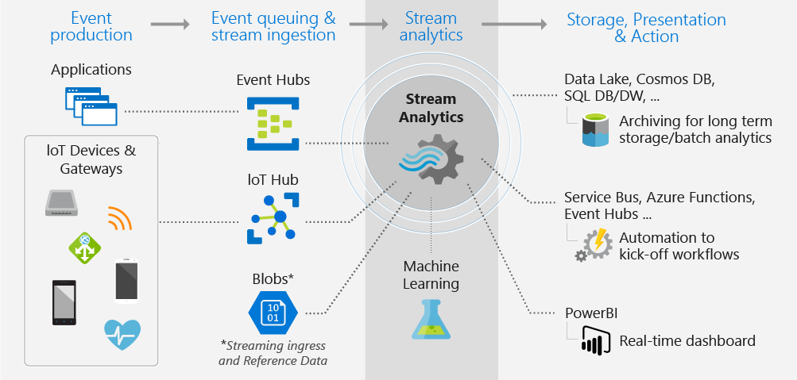

### Data Stream

A data stream is anything that is emitted by IoT devices, applications or data producers
There are two main types of stream data:

* Event Time: Each row of data depends on time (Real time data)
* Batch Process: Historic data not real-time (could also be near real-time)

### Continuous Processing (Real time)

Where data is being processed continuously. An service like Event Hub gets the data which it send to an stream processing service like Azure Stream Analytics where this data is processed and finally using in an visualization software like Power BI using real time dashboard  
Real-time data is useful when an alert needs to be raised based on which some action needs to be performed

### Read, Load, Process

In this approach data is read from various sources like Event Hub, IoT Hub and then loaded into a storage service like ADLS  
From here the data is loaded into an analytics service like Azure Stream Analytics from which visualization is done using [Power BI](../../../Tools%20&%20Services/Power%20BI/Power%20BI.md)  
Historical data is useful for making predictions, finding trends and performing analysis

---

### Event Objects

Events are small packets of data that are usually \<= 1 MB in size. They can be called datagrams as well  
Publisher: Sends data to Event Hub  
Producer: Generates an event data stream (Event Hub)  
Processor: Ingests and transforms the data (Analytics Service)  
Consumer (Subscriber): Displays or consumes data and takes action (Visualization Software)