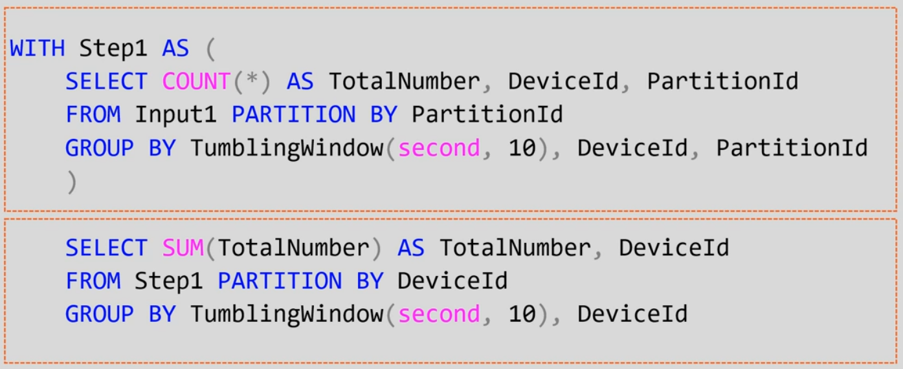
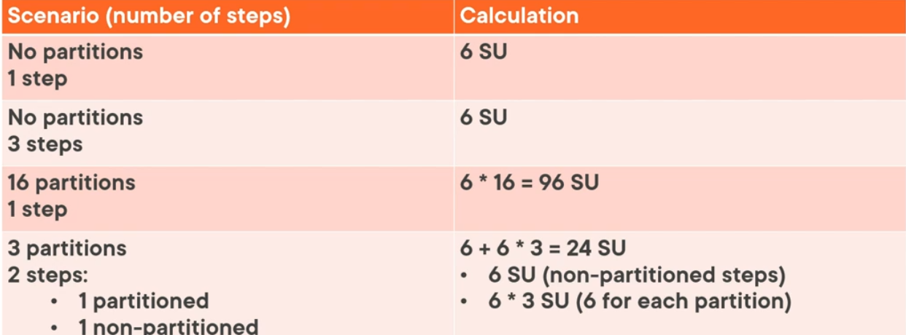

Streaming Units assigned for each job is variable and is dependent on the partition configuration  
It is best practice to always use more than what is required  
Streaming Unit % Utilization is the amount of memory that is consumed by the workload  
For light workload its between 10-20%  
If this value is greater than 80% or there are backlogged events then SUs need to be increased

---

### Calculate Maximum Streaming Units Required for a Job

Number of Steps in a Query

* Steps in a query can be identified using the WITH clause
* The SELECT after all the WITH clauses is also considered a step

The number of partitions in each step

* Max 6 SU for all non-partitioned steps
* Add 6 SU for each partition in a partitioned step

