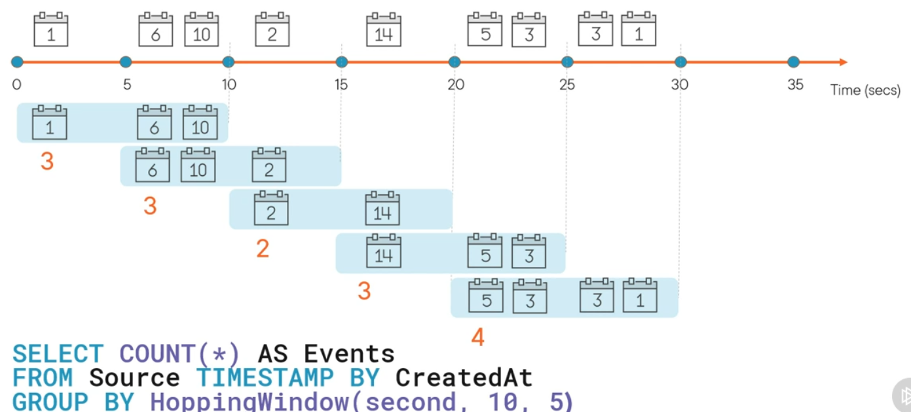
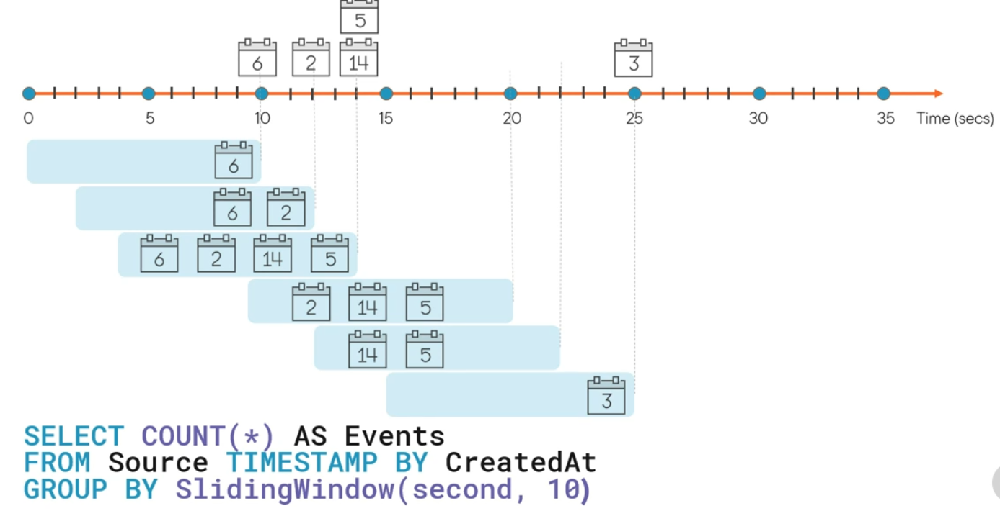
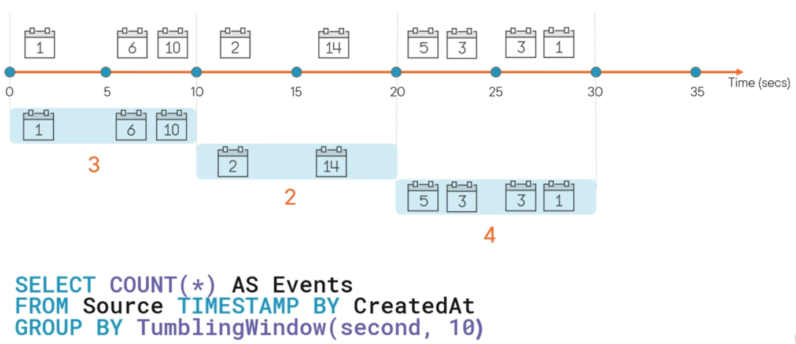
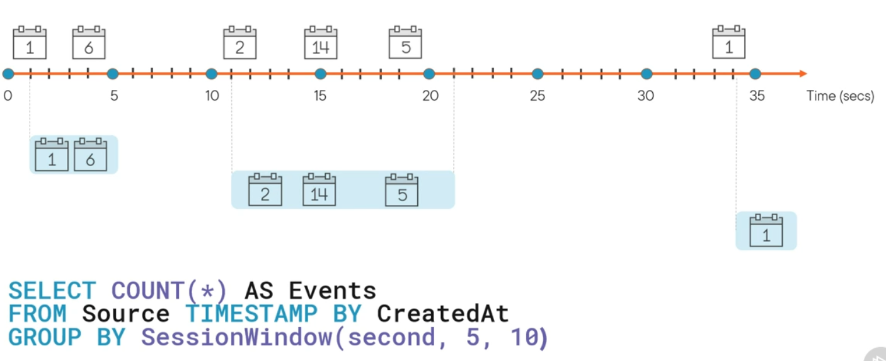
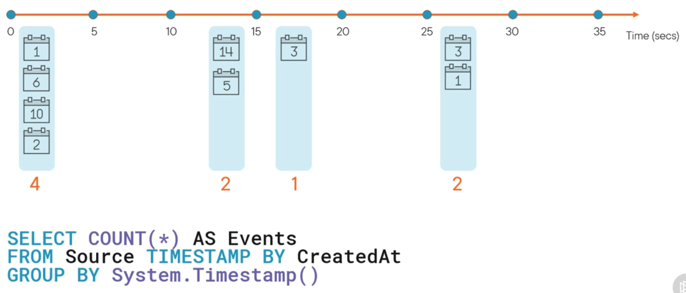

Functions that group data based on time  
There are overlapping and non-overlapping windows  
Hopping and Sliding are overlapping windows

### Hopping Window

Hopes forwards in time using a fixed period  
We need to specify the window size and the hop size. If both these values are same it is same as tumbling window  
Overlapping of events/ windows can occur when using hopping window

### Sliding Window

Does not aggregate values after a fixed time period  
A new output is created when a new event is recorded or when event falls out of the window  
An event can belong to more than one sliding window as well

### Tumbling Window

Splits data into distinct time segments in which we perform aggregation operations  
It is contagious, non-overlapping timing window and an event cannot belong to more than one window  
It is the most commonly used window function

### Session Window

Aggregates events that arrive at the same time  
When no events occur no window is created  
The `SessionWindow()` function takes three parameters the time unit, timeout size and the max duration size

### Snapshot Window

Groups events that occur at the same timestamp  
No window function is required

