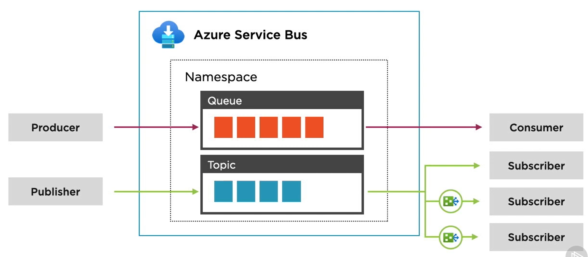

It is a fully managed Message Broker service  
Protocols: HTTP/HTTPS, AMQP  

Service Bus can be used to create Queue similar to [Azure Queue](../Azure%20Storage%20Services/Azure%20Queue.md)  
It can also create topics which are queues which can be monitored by multiple subscribers  
A subscription acts like a dedicated queue for the subscriber with its own configuration  

Supports message ordering FIFO (Needs to be enabled on queue and topic)  
Supports Duplicate Detection and Batch Processing

**DLQ (Dead-letter Queue)**  
Capture messages that where not processed in their lifetime and process them accordingly

[Azure Service Bus topic filters - Azure Service Bus | Microsoft Learn](https://learn.microsoft.com/en-us/azure/service-bus-messaging/topic-filters)

---

### Pricing Tiers

**Basic**  
Does not support Topics

**Standard**  
Uses "Pay as you go model"  
Variable throughput and variable message latency  
Supports messages up to 256 KB  
Supports auto-scaling  
Supports Queue and Topic Partitions

**Premium**  
Pricing and throughput is based on Messaging Units  
Requires configuration of scaling rules  
Messages up to 1 MB is supported  
Supports Availability Zone & Geo-disaster recovery  
Does not support Queue and Topic Partitions

---
