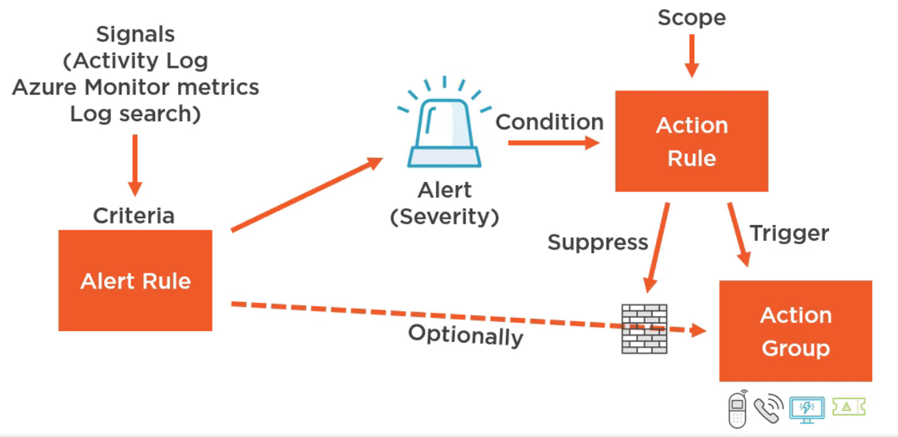

Proactively notify the user about any issue

### Alert Signal Sources

Subscription Activity Log: Has 90 days of retention for information  
Azure Monitor Metrics: Native time-series database. 90 days retention  
Log Analytics Log Search: Up to 2 years of retention

Leaving **Activity Log** & **Monitor Metrics** all the other metrics need to be sent to Log Analytics before it can be used as an Signal

Services that support auto scaling make use of metrics generated by Azure Monitor to decide when to scale
