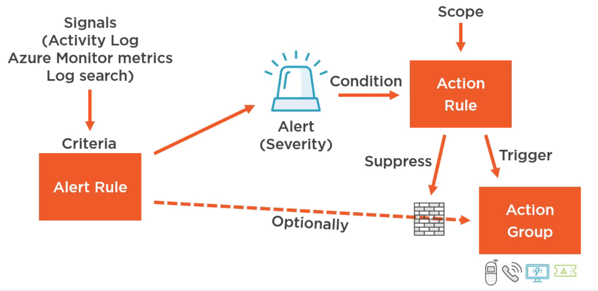
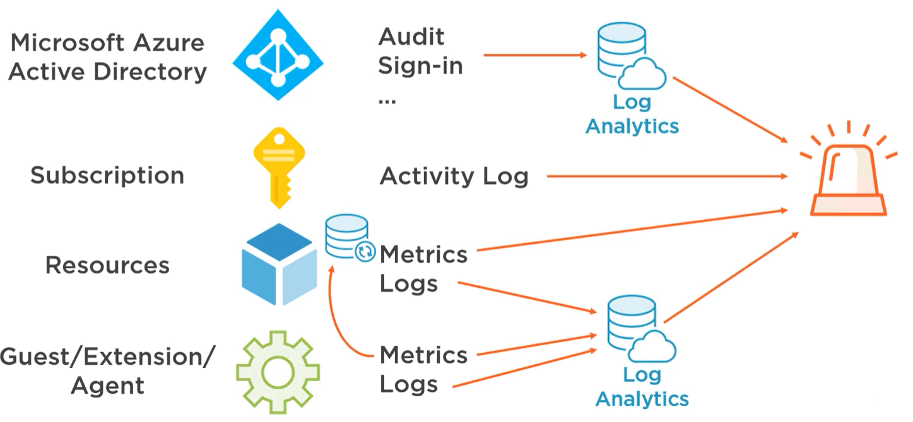

Proactively notify the user about any issue

**Alert Rule**: Condition to send alert (optionally can configure a Action Group)  
**Action Group**: A set of actions to perform  
**Action Rule**: Allows to conditionally trigger or suppress alerts

### Alert Signal Sources

Subscription Activity Log: Health and Auto scale Events. Has 90 days retention for information  
Azure Monitor Metrics: Native time-series database. 90 days retention  
Log Analytics Log Search: Up to 2 years of retention

The alerts a generated instantaneously when using data from Azure Monitor

Leaving **Activity Log** & **Metrics from Monitor** all the other metrics need to be sent to Log Analytics before it can be used as an Signal

Services that support auto scaling make use of metrics generated by Azure Monitor to decide when to scale

---

[Azure](../Azure.md)