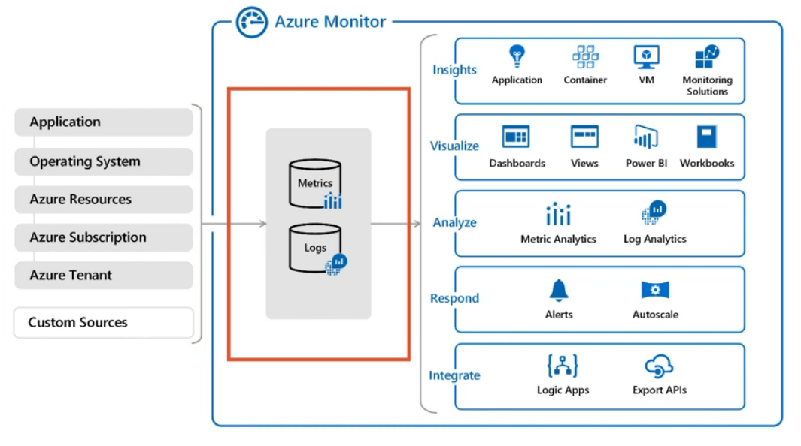

It is a powerful reporting and analytics tool  
It uses Monitor Logs and Metrics Store as the backbone for providing resource insights

For some services like SQL server we need to manually enable auditing and monitoring before Azure Monitor can collect data  
For VM we need to install Log Analytics Agent for collecting its data

[Azure Alerts](Azure%20Alerts.md) can be configured to be sent when certain conditions are satisfied

Azure Monitor Insights can be used to view KPIs for resources  
It can show Health, Performance, Capacity related insights

### Application Insights
Application Insights is an telemetries SDK which can be installed in our code  
It runs server side and optionally can setup to run on the client  
Application Insights are tracked using an an unique GUID (Instrumentation Key)  

App Center is an SDK similar to Application Insights that is used for Mobile Applications  
The insights from the Mobile App are sent to App Center from where we can configure App Center to send data to Application Insights  

[Azure Monitor overview - Azure Monitor | Microsoft Learn](https://learn.microsoft.com/en-us/azure/azure-monitor/overview)

---

[Azure](../Azure.md)