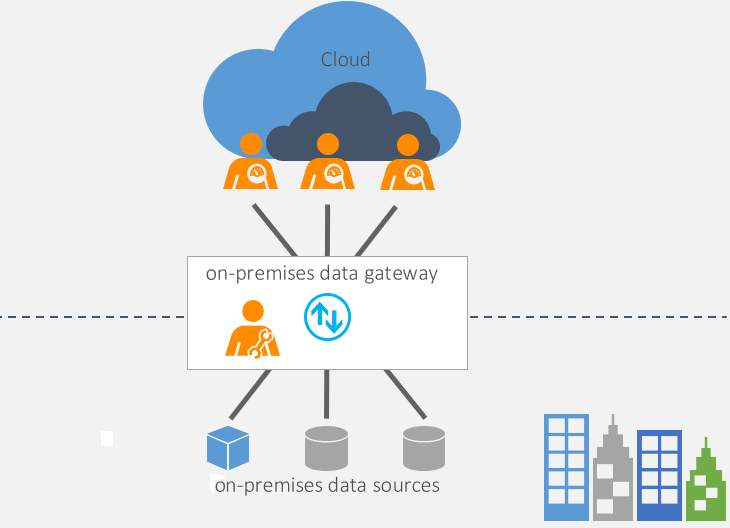

It is an service that allows to securely connect on-premises database to the cloud database  
A new update for the service is released every month

### Personal Mode

Allows one person to connect to on-premises data sources  
It only works with [Power BI](../../../Tools%20&%20Services/Power%20BI/Power%20BI.md) and cannot be used with other Azure services

---

**<u>References</u>**:
* [What is an on-premises data gateway? | Microsoft Docs](https://docs.microsoft.com/en-us/data-integration/gateway/service-gateway-onprem)
