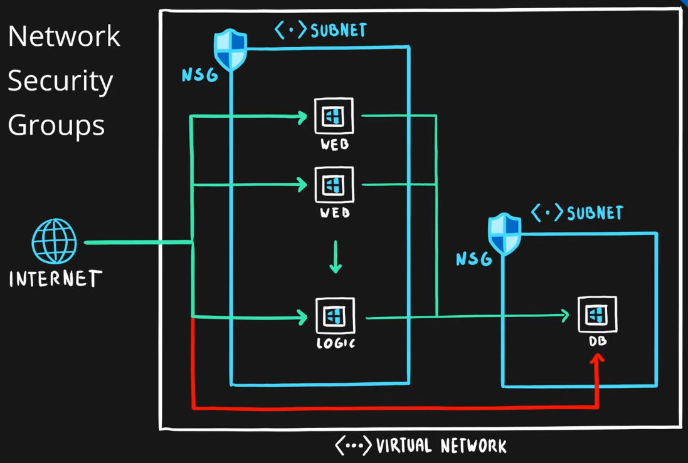

Designed to filter traffic going to and from the Resources that are present in a Virtual Network
Rules are used for creating Filters

### Componenets
* Source/Destination
* Protocol
* Ports
* Direction
* Priority (Order of Evaluation)