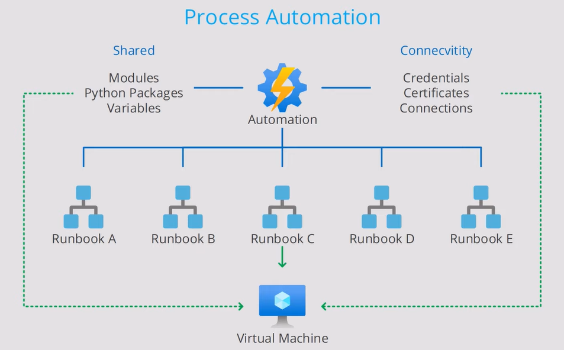
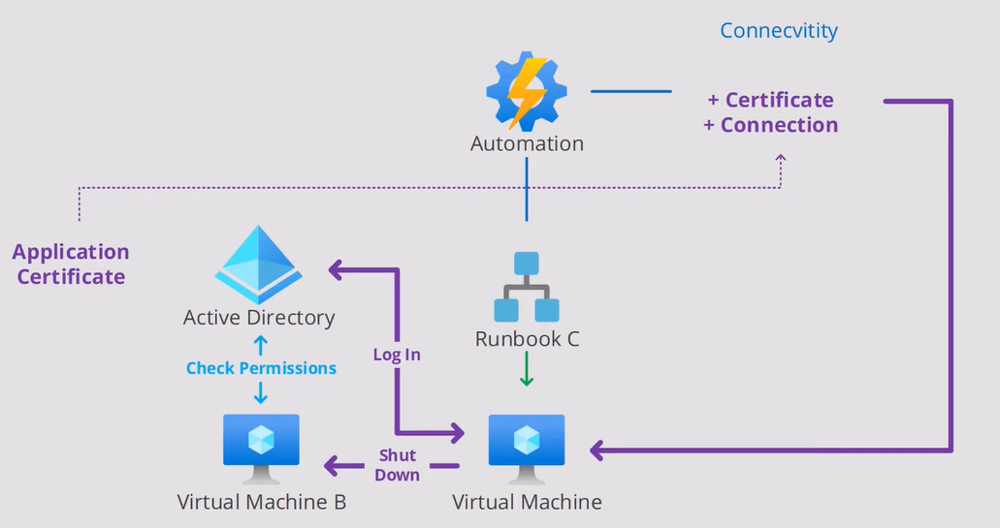

Cloud based automation and configuration management service that can be in Azure and non-Azure environments  

It provides:
- Process Automation
- Update Management
- [Azure Configuration Management](Azure%20Configuration%20Management.md)

### Process Automation

**Process Automation** allows to automate standard processes (DevOps processes, Azure Management, etc.)  
These automations can be performed using Graphical, PowerShell and Python runbooks

Runbook processing can be executed using Triggers (Scheduled, Event Based, Webhook)  
Hybrid Workers (VM with agent installed) allow to execute runbook on non-Azure environments

#### Run As Account

For enabling Run As Account **creator** has to have **Owner Role** on Subscription    
It is an App Registration (Service Principal) that is created in AAD   
This account is used to authenticate the Automation Scripts with AAD and to ensure it has the privileges required to perform the requested operation  
The **created account** gets assigned **Contributor Role** on Subscription

### Configuration Management

**Configuration Management** allows to collect inventory details and track changes  
Configure desired state configuration

---

[Azure](../../Azure.md)