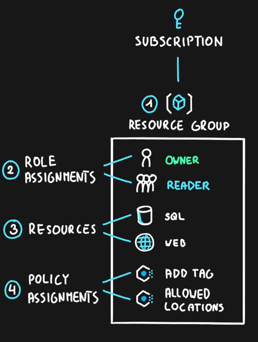

A blueprint is an guide, a pattern or a design for making something

Blueprint Definition: A collection of Azure Components (Resource Groups, Role Assignments, Resources, Policy Assignments) that can all be deployed with the click of an button. Describes what the blueprint should do  
Blueprint Assignment : Deploy all the resources in the Blueprint

It is used to automate the process of resource deployment in Azure  
The various components that can be used in Blueprints are called as Artifacts

