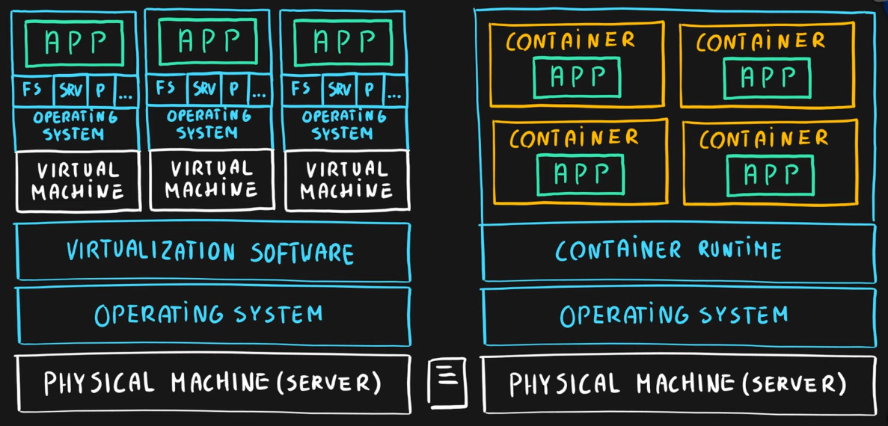

### Virtualization

Emulation of physical hardware  
Allows to have different virtual hardware configuration based on machine/app  
Allows to install different OS per machine/app  
Since each virtual machine is independent of each other it has its own FS, ports, services, storage, etc.

---

### Azure Virtual Machine

Provides pre-prepared images from Azure Marketplace  
Can create custom image as per requirement with custom services, runtime, apps, etc. and save in storage  
Azure VM will provision VMs based on these images that can then be accessed by end users  
Max Nodes : 1

It is IaaS (Infrastructure as a Service)  
We have total control over the OS and the services  
Does not provide autoscaling  
VMs are charged for even when they are in Stopped state (Storage Cost of the data that is stored on the VM disc)

Best suited for:

* Custom software requiring custom configuration
* Lift and Shift (Moving On premises services to the Cloud as it is)

Application/Scenarios:

* Web apps & Web services
* Databases
* Jump box
* Servers
* Gateways, etc.

---

### Virtual Machine Scale Set

Choose an image which is automatically scaled by creating multiple instances of the image  
This is hidden behind an Load Balancer  
The Users are redirected to one of the VMs in the Scale Set  
Max Nodes : 1000/ 600 (Depending on Image Selected)

Has auto scaling feature. Can be manually or automatically scaled based on need

---

### Azure Container Instances (ACI)

Take Application, Config and other requirements and create container image and host on container repository ([Docker](../../../Tools%20&%20Services/Docker/Docker.md) Hub, Azure Container Registry)  
Can use pre-created container images as well  
The Azure Container Instance will be generated/created in a Container Group (which is an VM in which the container runs)  
It is an serverless offering similar to Azure Functions

PaaS (Platform as a Service)  
Also called as Serverless Container  
No autoscaling  
Min Nodes : 0 (Jobs like running scripts)  
Max Nodes : 20

Use cases:

* Small and simple web apps
* Background jobs
* Scheduled Scripts

#azure-serverless-service 

---

### Azure [Kubernetes](../../../Tools%20&%20Services/Kubernetes/Kubernetes.md) Service (AKS)

Container orchestrator were we can create container Image or use Pre created Images  
These Images are managed by AKS which creates an Node (VM) on which the container runs  
Once the Nodes are deployed AKS allows users to access the Containers through a load balancer

Allows Autoscaling  
PaaS (Platform as a Service)  
Can be used to deploy almost anything  
Min Nodes : 3  
Max Nodes : 100

---

### App Services

Used to deploy Web Applications  
We need to create an Package which will be then deployed by App Service on multiple nodes which will be accessible to the users from the web

PaaS (Platform as a Service)  
Supports multiple programming languages and containers  
Autoscaling  
Max Nodes : 20/100 (Depending on Pricing Tier)

---

### Web App for Container (App Service)

Service used for deploying Web Applications that are containerized in App Service

---

### Azure Functions

Allows to deploy an small piece of code  
Create a package and deploy using AFs which are run on Nodes which are accessible as a service over the net

PaaS (Platform as a Service)  
Serverless  
Autoscaling

Two pricing plans:

* Consumption based plans
* Dedicated plans

Used for designing macro/nano services  
Min Nodes : 0  
Max Nodes: 200

#azure-compute-service #azure-serverless-service

---

### Azure Service Fabric

Microsoft's native container orchestrator similar to [Kubernetes](../../../Tools%20&%20Services/Kubernetes/Kubernetes.md)  
It is a distributed systems platform that allows us to run stateful applications

---

### Azure Batch

Allows to run large scale parallel and High Performance Computing (HPC) workloads on nodes (Virtual Machines) in a cluster