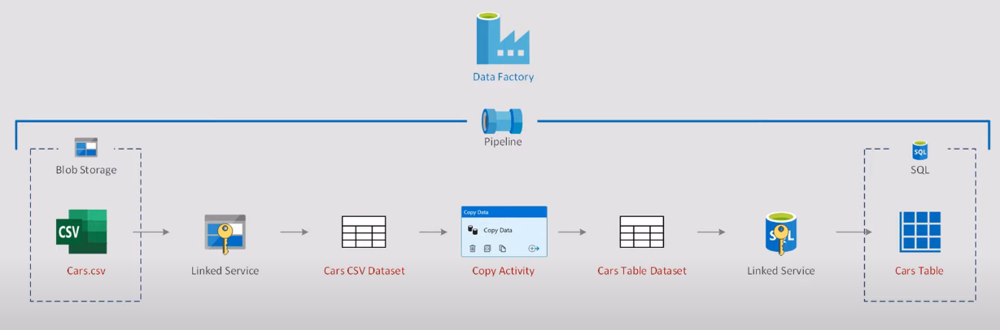
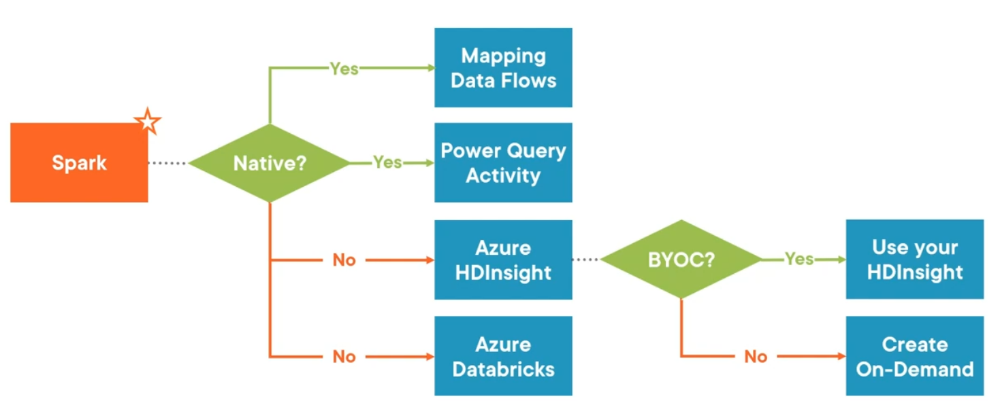

It is an data orchestration service provided by Azure. That can be used to perform various ETL operations  
It has support for 100+ connectors

Allows to create pipelines to schedule data driven workflows  
Build complex ETL processes that transform data visually with data flows  
Allows to use Azure Compute Services like ([Databricks Clusters](../../../../Data%20Analytics/Databricks/Databricks%20Clusters.md), [Azure HDInsight](../../Azure%20Analytics%20Services/Azure%20HDInsight.md), [Azure SQL DB](../../Azure%20Database%20Services/Azure%20SQL%20DB/Azure%20SQL%20DB.md))

---

### Annotations

Annotations are similar to the tags feature in Azure. There are used to identify pipelines in ADF  
They are additional pieces of information that can be used to filter and search for data factory

---

### Table of Content

* [Data Factory Components](Data%20Factory%20Components.md)
* [Monitoring & Version Control](Monitoring%20&%20Version%20Control.md)
