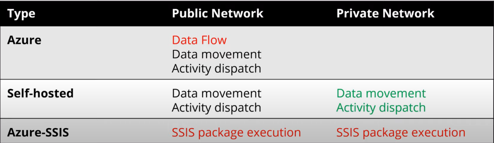
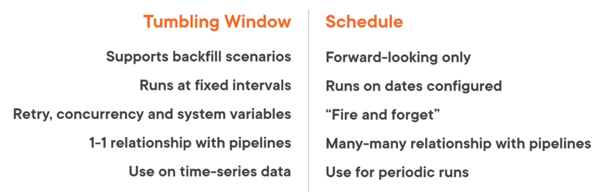

### Pipeline

It is a logical grouping of activities. It can be taught of as the ETL process  
Every job in DF runs inside an pipeline. A pipeline can consist of multiple activities  
Pipeline is the flow/ order in which the various operations are going to be carried out

---

### Activity

It is the individual operation that will be performed on the data

* Data Movement: Copy activity (90+ sources)
* Data Transformation: Mapping Data Flow, Power Query, External Services (HDInsight, Databricks, etc.)
* Data Control: For Each, Set/ Append Variable, Wait, Until

Mapping Data Flows allow us to perform transformation operations on our data without writing any code  
It makes use of an scaled-out Spark cluster to perform the operation  
Wrangling Data Flow is an flow that allows to wrangle data using Power Query

---

### Integration Runtime

The compute infrastructure of the Data Factory on which the activity is run

- Azure Integration Runtime: Data movement between public endpoints (Azure, [AWS](../../../AWS/AWS.md), [GCP](../../../GCP/GCP.md), SaaS offerings)
* Self-Hosted Integration Runtime: Connect to private and on-premises networks
* Azure-SSIS Integration Runtime: Allows to Run SQL Server Integration Services packages on ADF

When an new ADF resource is created an IR called Auto-Resolve IR (Azure IR) is created. 
Mapping Data Flow and Power Query is executed on the Azure IR

Self-Hosted IR requires an software to be installed which can connect to the private service  
Redundancy can be introduced in the system by installing the IR on multiple devices  
When Azure-SSIS IR is used an Virtual Machine with SQL Server is installed which will be used to run the SSIS packages

---

### Triggers

Defines when the pipeline will be executed

* On-demand Execution: Execute using trigger button or using code
* Create a Trigger: Automate Pipeline execution

A single trigger can be used to execute many pipelines and multiple triggers can execute a single pipeline  
When we create a trigger an JSON definition is created that holds the properties of that trigger like start and end times, recurrence, frequency, etc.  
Triggers can be deactivated or paused temporarily

There are three types of triggers:

* Scheduled Trigger: Suitable for tasks that need to run periodically
* Tumbling Window Trigger: Suitable when working with time sliced data
* Event based Trigger: Fired when an event occurs

 > [!INFO]
 > An trigger can only be created on an already published pipeline

### Tumbling Window Trigger

Tumbling Window Triggers are fired at periodic time intervals from the start time when they are created  
They are non-overlapping, fixed size, contagious running trigger

They have some advanced options like:

* Automatic Reruns we can specify the max retries
* Max concurrency, we can have up to 50 concurrent executions
* Trigger Dependency
* Delay Execution, max time to wait for the execution of a previous pipeline

They have some drawbacks as well:

* The pipeline and trigger have a 1:1 relation
* Some options cannot be edited once a trigger is created

### Event based Triggers

Event Triggers are of two types:

* Storage Event Trigger: They are fired on the creation/ deletion of data from Blob Storage. We can have 500 triggers per storage account
* Custom Event Triggers: Allows to fire trigger on custom topics which are custom events that are configured in Event Grid

---

### Linked Service

Tells ADF where the data and/ or compute is present  
It is similar to connection string that is used to connect to other services

---

### Dataset

It is an named view that points/ references the data that we want to use in the ADF
