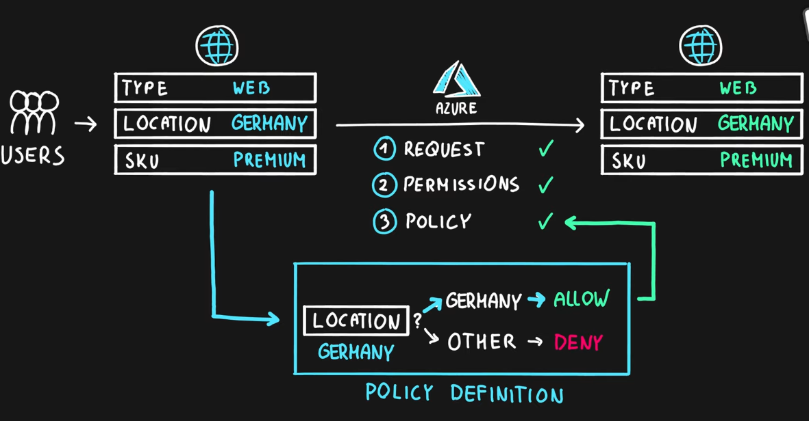

Policies allows to check for resource properties and then make decision based on these properties  
Policy can be created on any property and then an rule can be written around the policy to make a decide when the policy is True and when its False

Policies do not check for user permissions (It is assumed to be checked in the previous step)  
Policies are checked during the deployment of an resource  
Policy is an single rule that is checked. Multiple policies grouped together is called as an Initiative  
Policies are only applied to Resources that are newly created or modified. For applying to older resources the remediation option can be used  
Policy can be assigned to any scope: Management group, Subscription, Resource Group, Resource

Some of the allowed effects from Polices:

* Deny: Fail deployment
* Audit: Allow deployment but raise exception
* Append, Modify: Modify the policy before the deployment happens