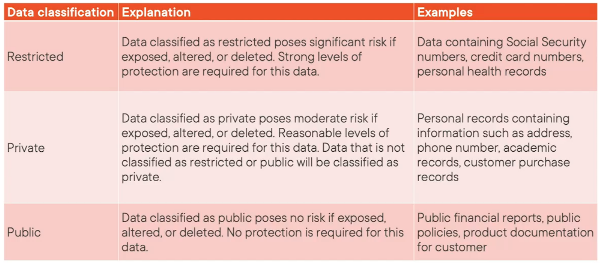
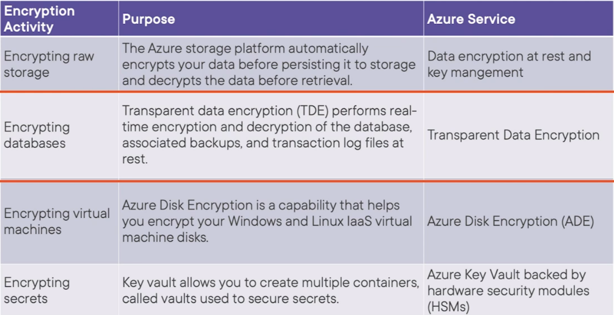

Encryption is the process of scrabbling data so that only authorized people can access it
* Symmetric Encryption
* Asymmetric Encryption

### Encryption at Rest

Ensures that data that is stored in Disk, Database, Storage Account is unreadable without the appropriate key  
Data at Rest is generally encrypted using Symmetric key

### Data in Motion/ Transit

Data that is actively moving between networks over the Internet/ private network  
Data in motion is highly critical and highly vulnerable hence needs to be properly secured  
Such data can be handled by sending it over an secure/ encrypted tunnel or encrypting the data before sending it over the network

### Types of Encryption Technique

Deterministic : Generates the same encrypted value all the time (Generally a IV is used to generate key)  
Randomized : More secure as a new key is generated all the time

---

### Data Auditing

Auditing data in Azure can be stored in Storage Accounts, Log Analytics and Event Hubs  
Auditing can be defined at SQL Server, Database level or both  
By default all the queries, authentication attempts, etc. are also stored