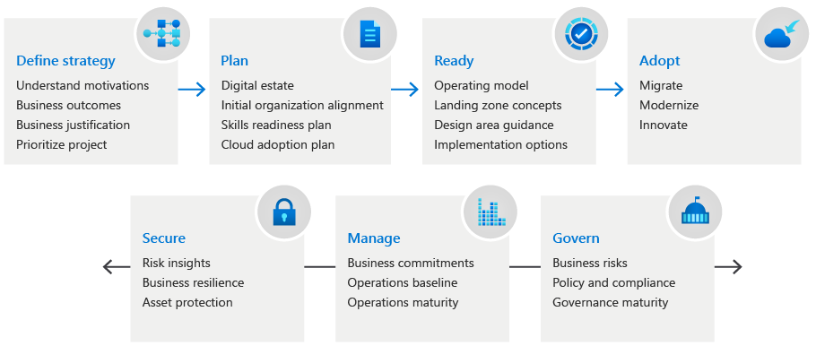
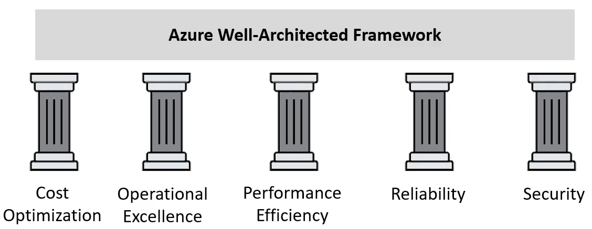

**CASB**: Cloud Access Security Brokers  
Sites between cloud users and cloud applications and monitors all activity and enforces security policies

**CSPM**: Cloud Security Posture Management  
Identify and remediate risks through security assessments and automated compliance monitoring

**Shadow IT**  
Business agility process where departments purchases and provisions their own IT resources without the approval of the centralized IT department  

**Automated Investigation and Remediation (AIR)**  
Uses inspection algorithm that triggers an alert that creates an incident. Once the incident is created its matched with an remediation action

#### Microsoft Security Principles  
**Control**: You in control of privacy with easy to use tools and clear choices  
**Transparency**: Transparent about data collection and use  
**Security**: Protect data using strong security and encryption  
**Strong Legal Protection**: Respect local privacy laws & fight for legal protection of data  
**No content-based targeting**: No targeted ads using email, chats, files or personal content 
**Benefits to you**: When we collect data its to make your experience better

#### Cloud Adoption Framework

[Microsoft Cloud Adoption Framework for Azure documentation - Cloud Adoption Framework | Microsoft Learn](https://learn.microsoft.com/en-us/azure/cloud-adoption-framework/overview)

#### Azure Well-Architecture Framework

**Cost Optimization**: Managing cost to maximize value delivered  
**Operational Excellence**: Operational processes that keep a service running in production  
**Performance Efficiency**: Ability of system to adapt to changes in load  
**Reliability**: Recover from failures and continue to function  
**Security**: Protecting application and services from threats  