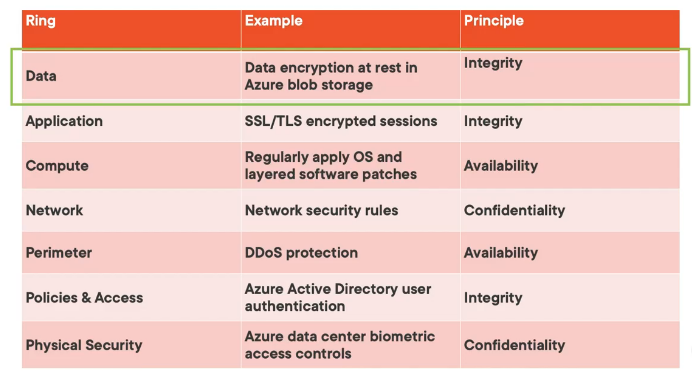

Data : Ensure proper security guidelines are used for the data that is saved in storage  
Application : Ensure the application is free from vulnerabilities  
Compute : Secure access to VM and endpoints for access  
Network : Limiting the network connectivity to all the resources to only what is required  
Perimeter : Protecting the resources from network based attacks  
Identity & Access : Ensuring that only authorized users have access to the resources  
Physical Security : Provide physical safeguards to ensure only authorized access to the data

