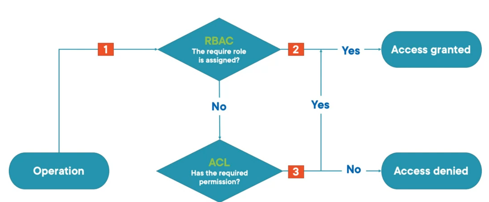

Shared Key Authorization  
Shared Access Key (SAS) Authorization  
Role-based access control (Azure RBAC) : Coarse grain access to data (the whole storage account or data lake)  
Access Control List (ACL) : Fine grained access to data (to files and directories)  
Anonymous Access : No authorization required

When Shared Key or SAS Key is used for Authentication RBAC and ACL have no effect  
A security principal is an object the represents a user, group, service principal, or managed identity that is defined in Azure Active Directory  
An security principle is required for using RBAC and ACL

---

### Role Based Access Control (RBAC)

Owner : Has full access to Blob storage container and data  
Contributor : Read, Write and Delete access to Blob containers and blobs  
Reader : Read and list blob container and blobs

---

### Access Control List (ACL)

**<u>Access ACLs</u>**  
Controls access to an object  
Access ACLs can be applied to files and folders

**<u>Default ACLs</u>**  
An ACL template that determines the ACL for the directory and its child directory  
Files do not have default ACLs  
Changing the default ACL of an parent does not affect the access ACL or default ACL of objects that already exist

 > [!NOTE]
 > * In POSIX style model the permissions for an item are stored in the items itself
 > * Permissions are only inherited if default permissions have been set on the parent element before the child items are created

 > [!INFO]
 > * RBAC always is evaluated first and takes precedence over ACL
 > * If RBAC provides the necessary access to a resource then it cannot be blocked by ACL