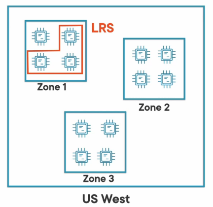
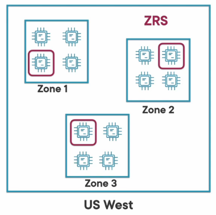

### Locally-Redundant Storage (LRS)

Copies data synchronously three times within a single AZ in the primary region  
It is the cheapest option but not recommended when high availability is required  
Provides eleven 9s durability

### Zone-Redundant Storage (ZRS)

Copies data synchronously three times within three AZ in the same region  
For high availability and durability this is the minimum recommended replication option  
A write request only returns as success if the write was possible in all three AZ  
Provides twelve 9s durability over a course of a year  
If a failure happens in any of the AZ Azure performs automatic failover  
Its option is not available in all regions and archive option is not available with this redundancy option

### Geo-Redundant Storage (GRS)

Copies the data synchronously three times in the same region using LRS and also copies the data asynchronously three time to another region  
By default reads and writes only go to the primary region  
We can configure the secondary region to allow read access (Read Access Geo-Redundant Storage)  
Provides sixteen 9s of durability

### Geo-zone-redundant Storage (GZRS)

Copies data synchronously three times within AZs in the primary region and asynchronously copies the data to the secondary region where it is synchronously copied three times into a AZ  
By default reads and writes only go to the primary region. We can configure the secondary region to allow read access (Read Access Geo-Zone-Redundant Storage)
Provides sixteen 9s of durability

---

**<u>References</u>**:

[Data redundancy - Azure Storage | Microsoft Docs](https://docs.microsoft.com/en-us/azure/storage/common/storage-redundancy)