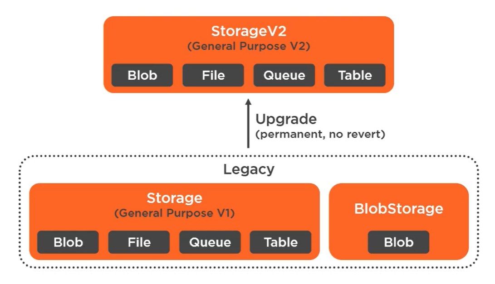
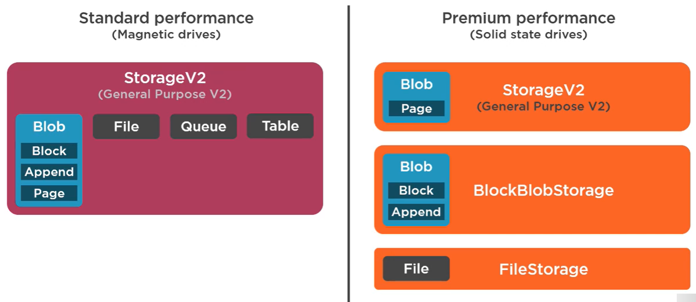

Storage Account v1 only supports LRS, GRS and RA-GRS  
Storage Account v2 Premium only supports LRS and ZRS  

Access Tiers are only Supported by Storage v2 and `BlobStorage`

### Performance Tiers

**Standard Performance**  
The cost effective storage solution and used for general access  
Uses HDD for storing the data

**Premium Performance**  
Useful for high throughput applications where low latency is required and small transactions are performed frequently  
Useful for interactive workloads, analytics, AL/ML and data transformation  

We cannot use Files, Queues and Tables in this Storage Account  
Of the Blob types only Page Blob is supported (They are used to store VM Disks)  
A `BlockBlobStorage` needs to be created to use the other two blob times in this tier

---

[Azure Storage Services](Azure%20Storage%20Services.md)
