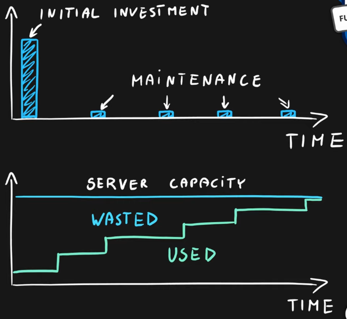
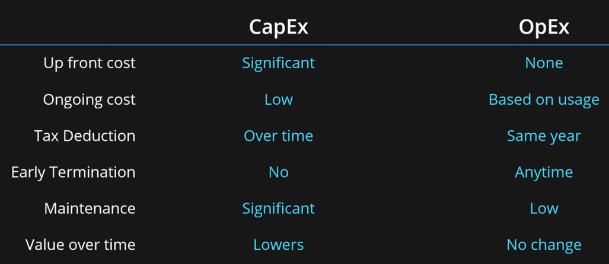

### Capital Expenditure

Own infrastructure  
Big Initial Investment  
Lots of maintenance required: Support Staff, Power, Networking, Hardware Failures, etc.

### Operational Expenditure

Rent Infrastructure  
No initial investment, pay as you use  
Minimal Maintenance: Operation Expenditure

