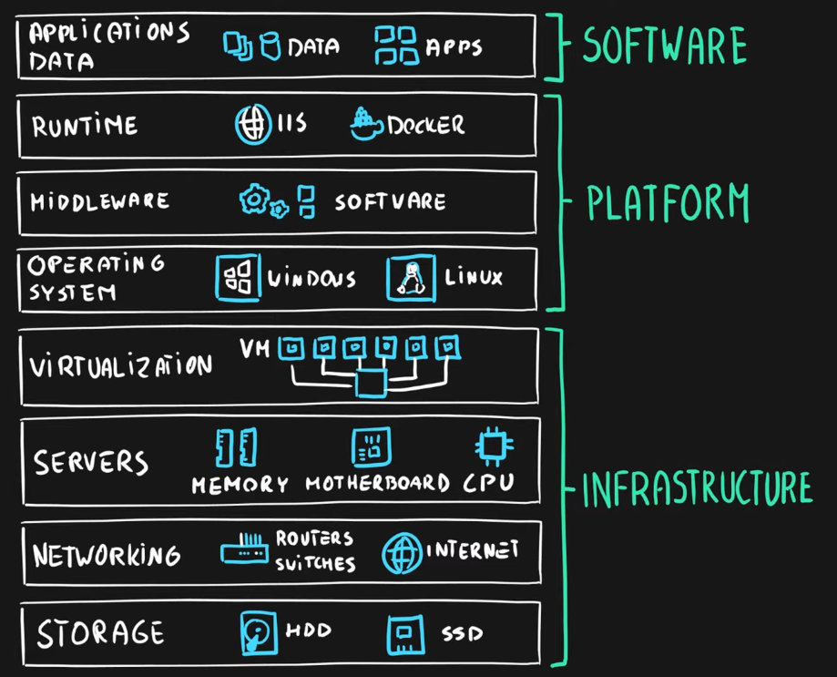

### Responsibility Model

---

### On Premises

Cloud provider manages nothing. We manage everything

* Infrastructure - Hardware, Virtualization, Storage & Networking
* Platform - OS, Middleware & Runtime
* Software - Application & Data

---

### Infrastructure as a Service (IaaS)

Cloud provider manages Infrastructure  
We manage Platform and Software  
CSP provides virtualized hardware to the user  
Used by Admins

**<u>Use cases</u>**  
Migration of workloads (On Premises to Cloud)  
Test & development  
Storage, backup & recovery (Extending On Premise Infrastructure)

**<u>Services Provided</u>**  
Virtual Machine  
Virtual Networks  
Managed Disks

---

### Platform as a Service (PaaS)

Cloud provider manages Infrastructure & Platform (OS, Middleware & Runtime)  
Used to develop, run, create, test applications  
Meant for Developers

**<u>Use Cases</u>**  
Development Framework  
Analytics & Business Intelligence

**<u>Services Provided</u>**  
SQL  
App Service (Web Services)  
Logic Apps (Enterprise Integration)  
Function Apps (Serverless)

**<u>Pros</u>**  
Easy to get up and running  
Reduced development time

**<u>Cons</u>**  
Lack of Control  
Vendor Lockin

---

### Software as a Service (SaaS)

Cloud provider manages everything (Infrastructure, Platform & Software)  
We don't have to install or update anything  
Products are offered over Internet using a subscription based model  
Meant for Customers

**<u>Use Cases</u>**  
Buying off the shelf applications