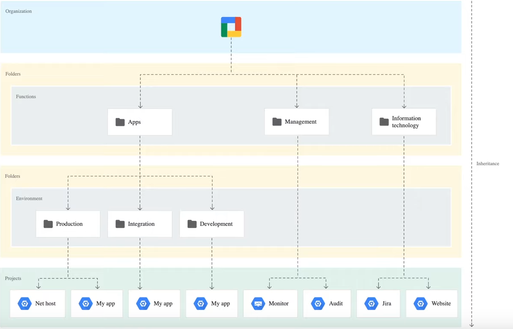
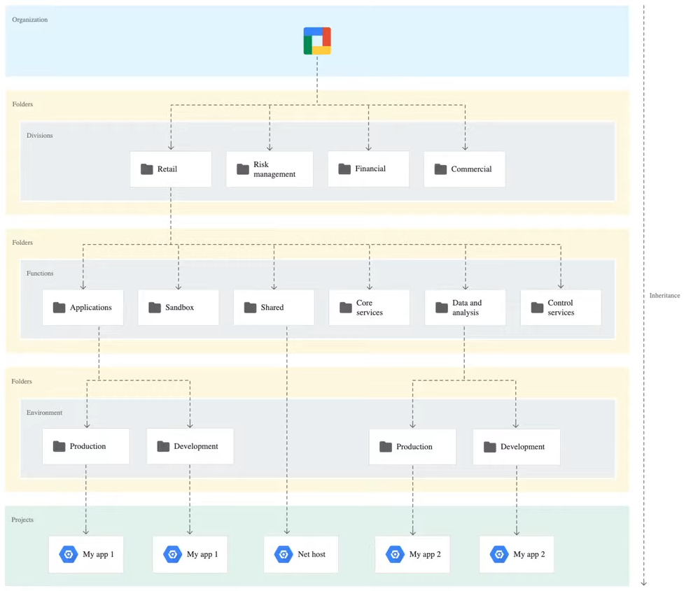

There are three suggested hierarchy architecture we can use:

1. **<u>Environment Oriented</u>**  
   Break down projects into different environments : Production, Quality Assurance, Development  
   Can pose challenge when need to deploy services that are used by multiple environments

1. **<u>Function Oriented</u>**  
   One organization that contains one folder per business function  
   More flexible compared to environment separation and allows to deploy shared resources  
   More complex to manage

3. **<u>Granular Access Oriented</u>**  
   One organization that contains one folder per business unit  
   Each business unit folder can contain one folder per business function  
   Each business function folder can contain one folder per environment  
   Most extensible and flexible and the most complicated to manage

