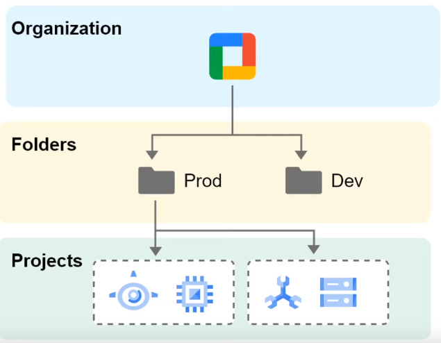

### Projects

A project is a logical grouping of resources  
A cloud resource **has to** belong to a project

Project Components:
* settings
* permissions
* other metadata

A project cannot access another projects resources unless we use [Shared VPC](../GCP%20Networking%20Services/GCP%20Networking%20Services.md#shared-vpc) or [VPC Network Peering](../GCP%20Networking%20Services/GCP%20Networking%20Services.md#vpc-network-peering)  
Resources within a project can work together easily

Each project has the following:
* A project name
* A project ID
* A project number

A project ID is unique across Google Cloud  
Projects can be deleted but their IDs cannot be used again

When billing is enabled, each project is associated with one [Cloud Billing Account](../GCP%20Support%20&%20Billing/Cloud%20Billing%20Account.md)  
Multiple projects can have their resource usage billed to the same account  
Projects acts as a namespace  
Resource names within a project should be unique but generally resource names can be reused across projects

We can create only up to 5 networks per project. If more is required then GCP Support has  to be contacted

---

### Folders

Allows you to logically group multiple projects that share common IAM permissions  
Used to isolate projects for different departments or different environment

