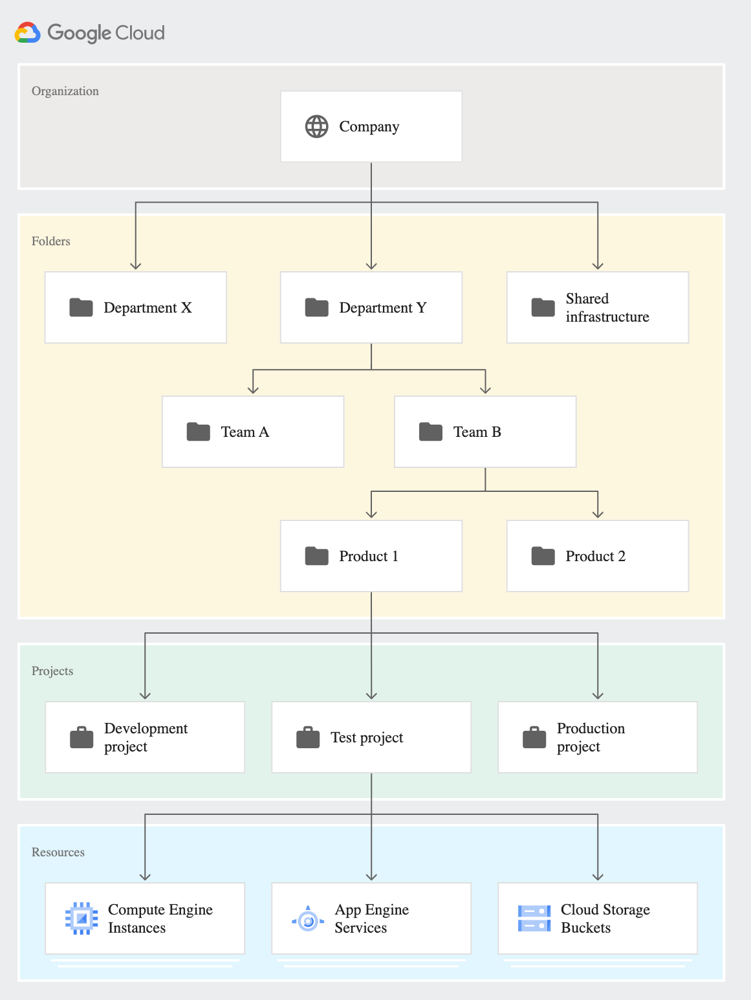

### Domain

Primary identity of the organization  
Linked to either a Google Workspace or Google [Cloud Identity](../GCP%20Security%20Services/Cloud%20Identity.md)  
An Google Workspace or [Cloud Identity](../GCP%20Security%20Services/Cloud%20Identity.md) Account can only have one organization

### Organization

Root node of the Google Cloud hierarchy of resources  
Define settings, permissions and policies for all projects, folders, resources and [Cloud Billing Account](../GCP%20Support%20&%20Billing/Cloud%20Billing%20Account.md)s it parents

### [GCP Project & Folders](GCP%20Project%20&%20Folders.md)

They are used to group similar resources together for easy management and tracking

### Labels

Categorize and Filter resources using key value pairs  
Great for cost tracking at a granular level
