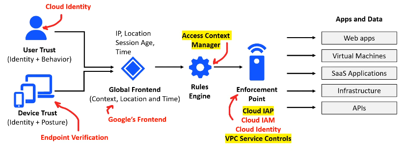

A zero-trust solution that enables secure access with integrated threat and data protection  
BeyondCorp Enterprise is built into the Chrome Browser with no agents required

A Zero Trust model puts <u>identity</u> as the <u>primary security perimeter</u> to be protected

BeyondCorp itself is just a collection of identity, access and security services to meet Zero Trust model requirements

**<u>BeyondCorp Principles</u>**

* Access to services must not be determined by the network from which you connect
* Access to services is granted based on contextual factors from the user and their device
* Access to services must be authenticated, authorized and encrypted

