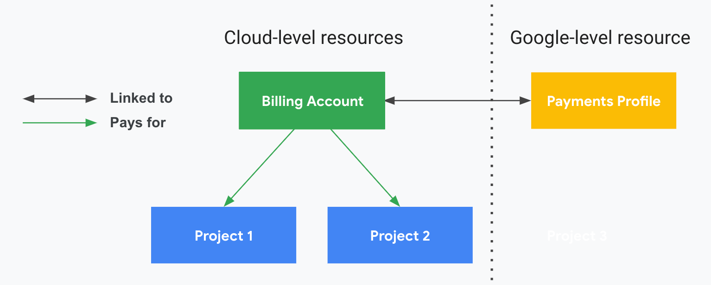

It is used to define who pays for a given set of Google Cloud resources and is connected to a Google payments profile

Billing account includes one or more billing contracts defined on the Payments profile
Billing account can have sub-accounts for resellers, so you can bill resources to be paid by your customers

IAM roles can be applied at the organization level, billing account level and/ or the project level

| Cloud Billing Account                                                                                   | Payments Profile                                                                                            |
| ------------------------------------------------------------------------------------------------------- | ----------------------------------------------------------------------------------------------------------- |
| Cloud level resource managed in Cloud Console                                                           | Google level resource                                                                                       |
| Tracks all of the costs incurred by GCP usage                                                           | Tracks cost across ALL of our google services (Google Ads, Fi phone service, etc.)                          |
| A billing account can be linked to one or more project                                                  | Processes payments for ALL Google services                                                                  |
| A single invoice is created per Billing Account                                                         | Stores information like name, address, etc. of who is responsible for the profile                           |
| Defines who pays for a given set of resources                                                           | Stores the various payment instruments (credit cards, debit cards, etc.) used throughout Google in the past |
| Connected to Payments Profile which includes a payment instrument, defining how you pay for the charges | Allows to view all the invoices, payment history, etc.                                                      |
| Has billing specific roles and permissions (established by IAM roles)                                   | Controls who can view and receive invoices for the various Billing Accounts and products                    |

---

### Billing Account Types

1. **<u>Self Serve (Online) Account</u>**  
   Payment instrument is a credit or debit card or its equivalent depending on the country/ region  
   Costs are charged automatically to the payment instrument  
   Supports Monthly And Threshold Billing (Charge cycle is automatically assigned and cannot be changed)

1. **<u>Invoice (Offline) Account</u>**  
   Payment instrument can be cheque or wire transfer  
   Invoices are sent by mail or electronically (Generally once a month)  
   We must be eligible for invoice billing

---

### Payment Profile Types

1. **<u>Individual</u>**  
   Using your account for your own personal payment  
   Only we can manage the profile, we can't add or remove users or change permissions on the profile

1. **<u>Business</u>**  
   Paying on behalf of a business, organization, partnership or educational institution  
   Payment Center is used to make payment from across Google Product offerings  
   Can add other users into the payment profile