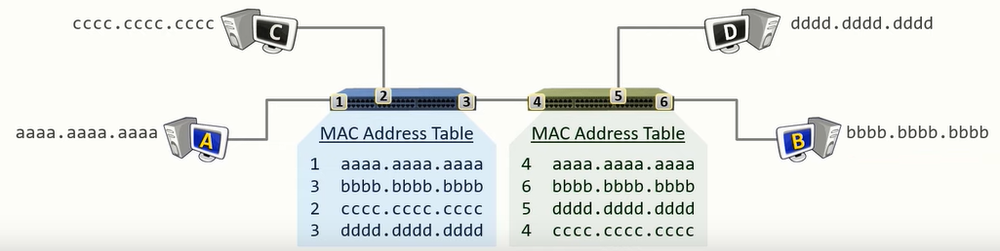

Switch has an internal table which is used to store information about the port the data originated from and the MAC address of the source

<u>Working</u>
  
Host A wants to sends frame (data) to Host B  
The data frame consist of the Source and Destination MAC Address  
Switch records Host A MAC Address on the port the data entered (Learning)  
As switch does not know the MAC Address of Host B it duplicates the packet and floods it on all the ports leaving source port (Flooding)  
The device that the data was not meant for will discard it quietly  
When Host B responds switch adds that MAC address to its table  
Switch already know which port Host A is connected to so it forwards the packet only on that port (Forwarding)

---

It is possible for the Switch to have multiple mappings for the same Port  
This generally occurs when a Switch is connected to another Switch

