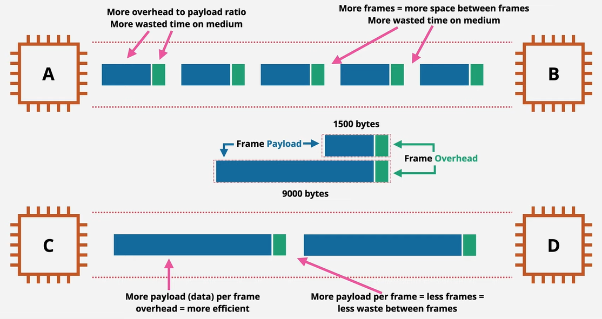

It is a network protocol that controls how data is transmitted over LAN (IEEE 802.3)  
Ethernet uses an <u>contention-based</u> approach to determine which device will use the network  
While contention-based network can lead to collisions, they have lower overhead compared to deterministic networks where an electronic token would need to be passed around for devices to use the network  
It use [CSMA/CD](../Data%20Link%20Layer%20Concepts/CSMA-CD.md) to detect if medium is empty  

### Ethernet Header

Contains Source MAC Address, Destination MAC Address, EtherType and Optional VLAN Tag  
EtherType fields is used to denote if the payload is using IPv4 or IPv6  
Payload is the encapsulated data that is received from the Network Layer  
The payload has a minimum size of 42 bytes if VLAN and 46 bytes if VLAN is not used  

By default Ethernet frames have a Payload size of 1500 bytes  
The max size of payload is called MTU (Maximum Transmission Unit)  
If we have more that to send more than 1500 bytes in a Frame then we need to allow Jumbo Frames (Frames that are more than 1500 bytes in size)

---
