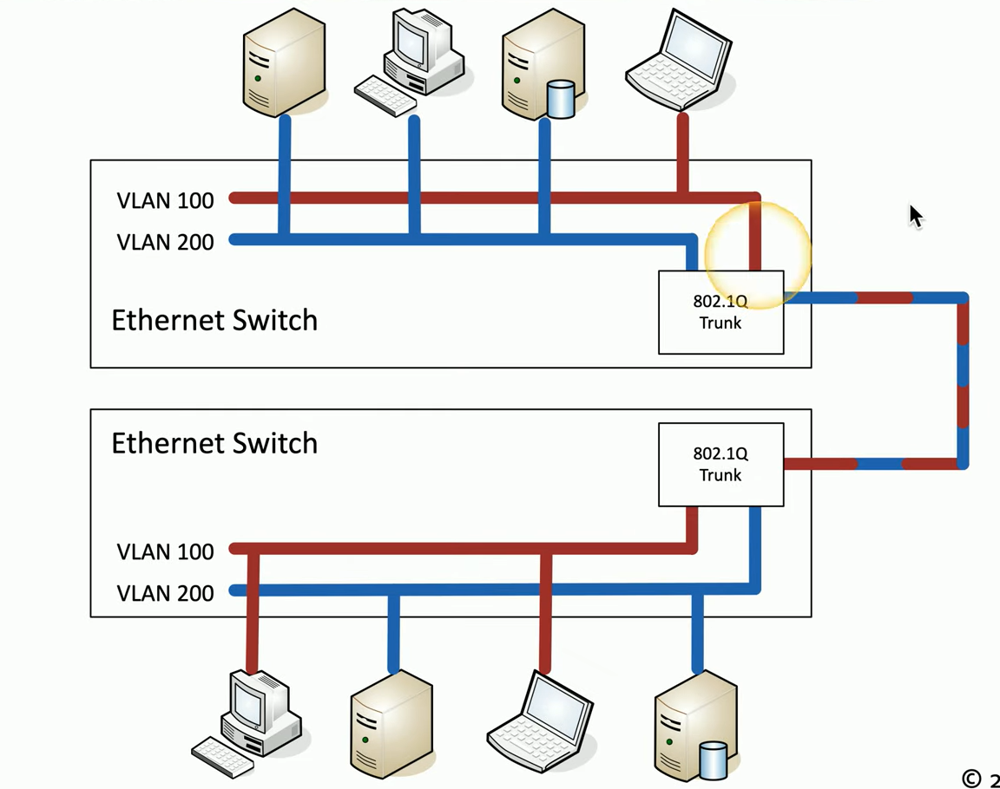

Break large physical LAN into smaller logical LANs  
This feature can be configured on managed switches  
Assigns specific switch interfaces (ports) on the switch to specific VLANs (Port 1, 2, 3 - VLAN 100 and Port 4, 5, 6 - VLAN 200, etc.)

VLANs reduce broadcast domain  
Allows to Segments network by role (HR, Sales). Increases security  
Devices on one VLAN cannot communicate with devices on another VLAN

VLANs can span multiple physical switches  
These VLANs on different switches can be joined together using Ethernet  

This solution but it does not scale well when there are multiple VLANs  
A lot of ports will be used up just to link the switches together

### VLAN Trunking

Part of the <u>802.1q</u> standard  
Allows a single interface (port) on the switch to act as a bridge for all the VLANs (Trunk Link)  

When packet is sent over the Trunk an additional header called VLAN header is added to each packet  
This header has two parts: Tag Protocol Identifier (TPI) & Tag Control Identifier (TCI)  
The details in this header allows the packet to find the correct VLAN

The VLAN that is left untagged becomes the default VLAN also called VLAN 0

---
