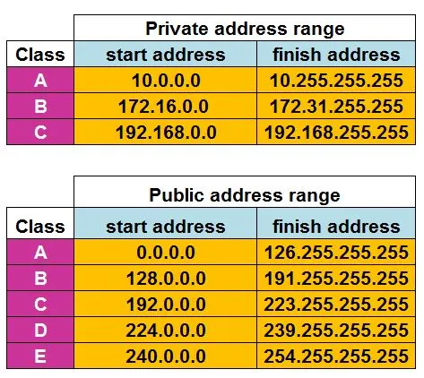

| Public IP Address                                                      | Private IP Address                                   |
| ---------------------------------------------------------------------- | ---------------------------------------------------- |
| Used "Registered" Public IP Addresses                                  | Unregistered - free to use by everyone               |
| Can be used on Public Network                                          | Cannot be routed or used on a Public Network         |
| They are unique and cannot be used by others                           | There are not unique and can be used by others       |
| By 1990's started running out of Public IP Addresses                   | Used inside an Organizations Internal Network        |
| Private IP Addresses and NAT (Network Address Translation) was created | NAT is used to speak with the outside Public Network |

[NAT (Network Address Translation)](NAT%20%28Network%20Address%20Translation%29.md) : Translates Private IP Address to Public IP Address  
The router has an Private Interface which is on the inside and a public interface which is facing the Internet

<u>Loopback Address</u>  
IP Address that sends any outgoing signals back to the same computer  
It was reserved for testing purposes and occupies the entire 127.0.0.0 Class A Subnet
127.0.0.1 or Localhost or Loopback