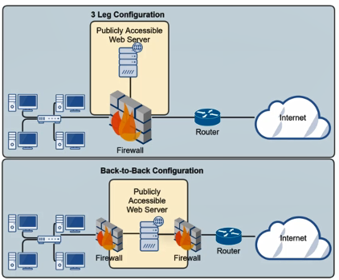

Is an type of network that is designed to be securely separated from the organizations Intranet (Extranet)  
Allows untrusted users outside an organizations LAN (intranet) to access services within the DMZ  
Two types of common configuration : Leg Configuration & Back-to-Back Configuration

 > [!INFO]
 > Extranet is similar to DMZ but they are used to allow trusted users (partners to access resources)